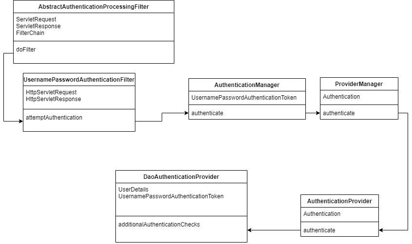

> Spring Security是一个框架，提供针对常见攻击的身份验证，授权和保护。通过对命令式和反应式应用程序的一流支持，它是保护基于Spring的应用程序的事实标准。本章只是对Spring Security 认证流程的一个大概的认知！<!--more-->

	##  Spring Security模块

1. 核心模块：包含核心的验证和访问控制类和接口，远程支持和基本的配置API。

2. 远程调用：提供Spring Remoting的集成。

3. 网页：包括网站安全的模块，提供网站认证服务和基于URL访问控制。

4. 配置：包含安全命令空间的解析代码。

5. LDAP：LDAP验证和配置代码。主要用于LDAP验证和管理LDAP用户实体

6. ACL访问控制表：ACL专门的领域对象的实现。主要用于在程序中应用安全特定的领域对象实例。

7. CAS：Spring Security的CAS客户端集成。主要用于CAS的SSO服务器使用Spring Security网页验证需要该模块。

8. OpenID：OpenID 网页验证支持。使用外部的OpenID服务器验证用户。

9. Test：支持Spring Security的测试。

   ## 执行流程

   

   1. 输入用户名、密码后点击登录按钮，先进入 UsernamePassworkAuthenticationFilter 的父类
      AbstractAuthenticationProcessingFilter 调用 doFilter() 方法，然后再执行 UsernamePasswordAuthenticationFilter 的 attemptAuthentication() 方法进行验证。

      ```java
      public void doFilter(ServletRequest req, ServletResponse res, FilterChain chain) throws IOException, ServletException {
          HttpServletRequest request = (HttpServletRequest)req;
          HttpServletResponse response = (HttpServletResponse)res;
          if (!this.requiresAuthentication(request, response)) {
              chain.doFilter(request, response);
          } else {
              if (this.logger.isDebugEnabled()) {
                  this.logger.debug("Request is to process authentication");
              }
      
              Authentication authResult;
              try {
                  // 执行认证流程
                  authResult = this.attemptAuthentication(request, response);
                  if (authResult == null) {
                      return;
                  }
      
                  this.sessionStrategy.onAuthentication(authResult, request, response);
              } catch (InternalAuthenticationServiceException var8) {
                  this.logger.error("An internal error occurred while trying to authenticate the user.", var8);
                  this.unsuccessfulAuthentication(request, response, var8);
                  return;
              } catch (AuthenticationException var9) {
                  this.unsuccessfulAuthentication(request, response, var9);
                  return;
              }
      
              if (this.continueChainBeforeSuccessfulAuthentication) {
                  chain.doFilter(request, response);
              }
              //认证成功
              this.successfulAuthentication(request, response, chain, authResult);
          }
      }
      
      ```

      2. 通过UsernamePasswordAuthenticationFilter过滤器将传入的username和password组装成UsernamePasswordAuthenticationToken对象。

         ```java
         username = username.trim();
         UsernamePasswordAuthenticationToken authRequest = new UsernamePasswordAuthenticationToken(username, password);
         this.setDetails(request, authRequest);
         return this.getAuthenticationManager().authenticate(authRequest);
         ```

      3. 将UsernamePasswordAuthenticationToken传递到AuthenticationManager的anthenticate方法。

      4. AuthenticationManager委托给ProviderManager的authencate方法进行执行。

         ```java
         for (AuthenticationProvider provider : getProviders()) {
             //过滤掉测试模块类
            if (!provider.supports(toTest)) {
               continue;
            }
         
            if (debug) {
               logger.debug("Authentication attempt using "
                     + provider.getClass().getName());
            }
         
            try {
               result = provider.authenticate(authentication);
         
               if (result != null) {
                  copyDetails(authentication, result);
                  break;
               }
            }
            catch (AccountStatusException e) {      prepareException(e, authentication);
               // SEC-546: Avoid polling additional providers if auth failure is due to
               // invalid account status
               throw e;
            }
            catch (InternalAuthenticationServiceException e) {
               prepareException(e, authentication);
               throw e;
            }
            catch (AuthenticationException e) {
               lastException = e;
            }
         }
         ```

      5. ProviderManager将authentication传递给AbstractUserDetailAuthenticationProvider的authenticate方法。

         ```java
         UserDetails user = this.userCache.getUserFromCache(username);
         
         if (user == null) {
            cacheWasUsed = false;
         
            try {
               // 获取UserDetails
               user = retrieveUser(username,
                     (UsernamePasswordAuthenticationToken) authentication);
            }
            catch (UsernameNotFoundException notFound) {
               logger.debug("User '" + username + "' not found");
         
               if (hideUserNotFoundExceptions) {
                  throw new BadCredentialsException(messages.getMessage(
                        "AbstractUserDetailsAuthenticationProvider.badCredentials",
                        "Bad credentials"));
               }
               else {
                  throw notFound;
               }
            }
         
            Assert.notNull(user,
                  "retrieveUser returned null - a violation of the interface contract");
         }
         
         try {
            // 在用户名密码验证之前进行的预操作
            preAuthenticationChecks.check(user);
            additionalAuthenticationChecks(user,
                  (UsernamePasswordAuthenticationToken) authentication);
         }
         catch (AuthenticationException exception) {
            if (cacheWasUsed) {
               // There was a problem, so try again after checking
               // we're using latest data (i.e. not from the cache)
               cacheWasUsed = false;
               user = retrieveUser(username,
                     (UsernamePasswordAuthenticationToken) authentication);
               preAuthenticationChecks.check(user);
               additionalAuthenticationChecks(user,
                     (UsernamePasswordAuthenticationToken) authentication);
            }
            else {
               throw exception;
            }
         }
         
         postAuthenticationChecks.check(user);
         
         if (!cacheWasUsed) {
            this.userCache.putUserInCache(user);
         }
         
         Object principalToReturn = user;
         
         if (forcePrincipalAsString) {
            principalToReturn = user.getUsername();
         }
         //返回认证成功的用户信息（Authentication）
         return createSuccessAuthentication(principalToReturn, authentication, user);
         ```

      6. AbstractUserDetailAuthenticationProvider的additionalAuthenticationChecks进行用户名与密码的验证，获取UserDetails通过其子类DaoAuthenticationProvider类实现。在DaoAuthenticationProvider中通过UserDetailsService的loadUserByUsername方法进行获取。而DaoAuthenticationProvider只是其最简单的一个实现。

      7. 当用户验证成功后，利用SecurityContextHolder用来存储安全的上下文信息。保存当前的访问者信息。

         ```java
         protected void successfulAuthentication(HttpServletRequest request, HttpServletResponse response, FilterChain chain, Authentication authResult) throws IOException, ServletException {
             if (this.logger.isDebugEnabled()) {
                this.logger.debug("Authentication success. Updating SecurityContextHolder to contain: " + authResult);
             }
             // 验证成功后，将用户信息保存到SecurityContextHolder中
             SecurityContextHolder.getContext().setAuthentication(authResult);
             this.rememberMeServices.loginSuccess(request, response, authResult);
             if (this.eventPublisher != null) {
                 this.eventPublisher.publishEvent(new InteractiveAuthenticationSuccessEvent(authResult, this.getClass()));
             }
         
             this.successHandler.onAuthenticationSuccess(request, response, authResult);
         }
         ```

         ##  主要接口释义

         #### Authentication验证信息

         ```java
         public interface Authentication extends Principal, Serializable {
             //权限信息列表，默认是GrantedAuthority接口的一些实现类。通常是代表权限的一系列字符串。
             Collection<? extends GrantedAuthority> getAuthorities();
             //密码信息，用户输入的密码字符串，在认证过后通常会被移除，用于保障安全。
             Object getCredentials();
             // 详细信息，web应用中的实现接口通常为WebAuthenticationDetails，它记录了访问者的ip地址和sessionID的值。
             Object getDetails();
             // 身份信息，大部分情况下返回的是UserDetails接口的实现类。在未认证的情况下获取到的是用户名，在已认证的情况下获取到的是UserDetails。
             Object getPrincipal();
             // 获取当前Authentication是否已认证。
             boolean isAuthenticated();
             // 设置当前Authentication是否已认证。
             void setAuthenticated(boolean isAuthenticated) throws IllegalArgumentException;
         }
         ```

         #### UserDetails用户核心信息

         ```java
         public interface UserDetails extends Serializable {
             //获取用户权限，本质是用户的校色信息
            Collection<? extends GrantedAuthority> getAuthorities();
             //获取密码
            String getPassword();
             //获取用户名
            String getUsername();
             //账户是否过期
            boolean isAccountNonExpired();
             //账户是否被锁定
            boolean isAccountNonLocked();
             //密码是否过期
            boolean isCredentialsNonExpired();
             //账户是否可用
            boolean isEnabled();
         }
         ```