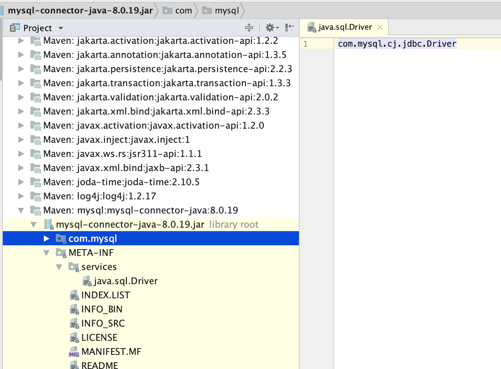
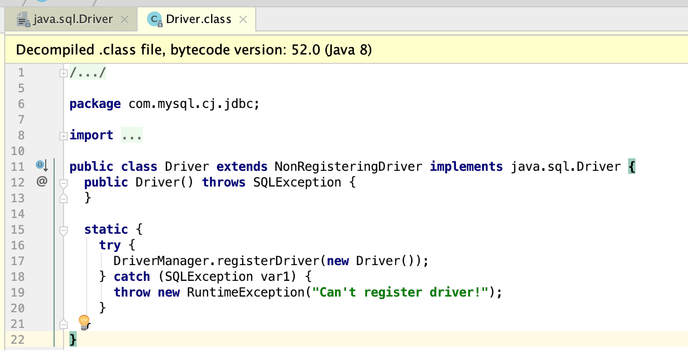

> SPI 模式在开发中用到的地方很多，但是一直和Dubbo的SPI混淆在一起，本文对JDK的SPI和Dubbo的SPI区分的一个概念的大略了解，为了后取对Dubbo框架的熟悉做一个基础。<!--more-->

## 什么是SPI？

SPI的全称是Service Provider Interface，用来被第三方实现或者扩展的API。也就是说SPI是一种服务发现机制。而对于我的理解就是：SPI是为某个接口寻找实现类的机制，有点类似于IOC，用于解耦。

### JDK SPI

SPI具体约定：当服务的提供者，提供了一种服务之后，在jar包的META-INF/Services/目录里同时创建一个以服务接口全路径命名的文件，该文件里就是实现该服务的接口的具体命名的实现类。当第三方服务需要引入这个模块的时候，就可以通过该jar包的MATE-INF/Services/里的配置文件找到具体的实现类名，通过JDK提供的工具类java.util.ServiceLoader进行加载实例化。

最常见的就是数据库驱动包，以mysql为例，正如上面所讲的一样，在META-INF/Services/目录下创建以java.sql.Driver文件，文件中是接口的具体实现类。



而配置文件中具体的实现类如下：



## Dubbo的SPI

### Dubbo SPI约定

dubbo的SPI加载类和JDK的SPI记载类不同， dubbo的记载类org.apache.dubbo.common.extension.ExtensionLoader，进入源码：

```java
// 兼容了JDK SPI的配置文件放置位置
private static final String SERVICES_DIRECTORY = "META-INF/services/";

private static final String DUBBO_DIRECTORY = "META-INF/dubbo/";

private static final String DUBBO_INTERNAL_DIRECTORY = DUBBO_DIRECTORY + "internal/";
```

```java
/**
 * synchronized in getExtensionClasses
 * */
private Map<String, Class<?>> loadExtensionClasses() {
    cacheDefaultExtensionName();
		// 加载配置文件约定放置的位置
    Map<String, Class<?>> extensionClasses = new HashMap<>();
    loadDirectory(extensionClasses, DUBBO_INTERNAL_DIRECTORY, type.getName());
    loadDirectory(extensionClasses, DUBBO_INTERNAL_DIRECTORY, type.getName().replace("org.apache", "com.alibaba"));
    loadDirectory(extensionClasses, DUBBO_DIRECTORY, type.getName());
    loadDirectory(extensionClasses, DUBBO_DIRECTORY, type.getName().replace("org.apache", "com.alibaba"));
    loadDirectory(extensionClasses, SERVICES_DIRECTORY, type.getName());
    loadDirectory(extensionClasses, SERVICES_DIRECTORY, type.getName().replace("org.apache", "com.alibaba"));
    return extensionClasses;
}
```

由上面两段源码可知，在Dubbo启动的时候，会默认扫描META/-INF/services、META-INF/dubbo/、META-INF/dubbo/internal三个目录，其实Dubbo的SPI和JDK SPI类似，同样需要在以上三个目录中放置以全路径名为命名的配置文件，而配置文件的内容为key=扩展节点实现的全路径名，如果由多个实现类则使用换行符分割。key会作为Dubbo SPI注解中的传入参数。

### SPI的缓存

```java
// 扩展类与对应的扩展类加载起缓存
private static final ConcurrentMap<Class<?>, ExtensionLoader<?>> EXTENSION_LOADERS = new ConcurrentHashMap<>();

// 扩展名与类初始化后的缓存
private static final ConcurrentMap<Class<?>, Object> EXTENSION_INSTANCES = new ConcurrentHashMap<>();

private final Class<?> type;

private final ExtensionFactory objectFactory;

// 扩展类与扩展名缓存
private final ConcurrentMap<Class<?>, String> cachedNames = new ConcurrentHashMap<>();

// 普通扩展类缓存，不包括自适应的拓展类和Wrapper
private final Holder<Map<String, Class<?>>> cachedClasses = new Holder<>();
// 扩展名与@Activate的缓存
private final Map<String, Object> cachedActivates = new ConcurrentHashMap<>();
// 扩展名与扩展对象缓存
private final ConcurrentMap<String, Holder<Object>> cachedInstances = new ConcurrentHashMap<>();
// 实例化后的自适应扩展对象，只能同时存在一个
private final Holder<Object> cachedAdaptiveInstance = new Holder<>();
// 自适应扩展类缓存
private volatile Class<?> cachedAdaptiveClass = null;
private String cachedDefaultName;
private volatile Throwable createAdaptiveInstanceError;

//Wrapper类缓存
private Set<Class<?>> cachedWrapperClasses;
```

由上面源码可以明确的分为Class缓存，实例缓存。

```java
public void addExtension(String name, Class<?> clazz) {
  	// 1. 加载Class
    getExtensionClasses(); // load classes
		// 2. Class 判断
    if (!type.isAssignableFrom(clazz)) {
        throw new IllegalStateException("Input type " +
                clazz + " doesn't implement the Extension " + type);
    }
    if (clazz.isInterface()) {
        throw new IllegalStateException("Input type " +
                clazz + " can't be interface!");
    }

    if (!clazz.isAnnotationPresent(Adaptive.class)) {
        if (StringUtils.isBlank(name)) {
            throw new IllegalStateException("Extension name is blank (Extension " + type + ")!");
        }
      	// Class 缓存中是否已经有该Class类
        if (cachedClasses.get().containsKey(name)) {
            throw new IllegalStateException("Extension name " +
                    name + " already exists (Extension " + type + ")!");
        }
				// 将要加载的扩展类的名字进行保存（即使扩展类获取不到，也可以知道是哪个扩展类没有获取到）
        cachedNames.put(clazz, name);
      	// 将Class文件存入缓存
        cachedClasses.get().put(name, clazz);
    } else {
        if (cachedAdaptiveClass != null) {
            throw new IllegalStateException("Adaptive Extension already exists (Extension " + type + ")!");
        }

        cachedAdaptiveClass = clazz;
    }
}
```

```java
// 加载Class
private Map<String, Class<?>> getExtensionClasses() {
  			// 1.1 从Class缓存中获取Class
        Map<String, Class<?>> classes = cachedClasses.get();
  			// 1.2 Class 不存在
        if (classes == null) {
            synchronized (cachedClasses) {
              	// 防止重复获取
                classes = cachedClasses.get();
                if (classes == null) {
                  	// 1.3 从配置中加载Class类
                    classes = loadExtensionClasses();
                  	// 1.4 缓存中保存Class类
                    cachedClasses.set(classes);
                }
            }
        }
  			// 1.5 返回Class类
        return classes;
    }
```


1. Class缓存优先从缓存中读取，如果缓存中不存在，则加载配置文件，根据配置把Class缓存到内存中，但并不会全部初始化，会按需初始化。

2. 实例缓存每次获取的时候，会先从缓存中获取，如果缓存中读取不到，则重新加载缓存起来。

而Class缓存和实例缓存根据其特性又可以分为普通扩展类、包装扩展类、自适应扩展类、其他缓存。

## 总结

在官方文档中两者的比较如下：

1. JDK标准的SPI会一次性实例化扩展的所有实现，即使内有用上也会加载。
2. 如果加载失败，则连扩展的名称都获取不到。
3. 增加了对扩展IoC和AOP的支持，一个扩展可以直接setter注入其他扩展。