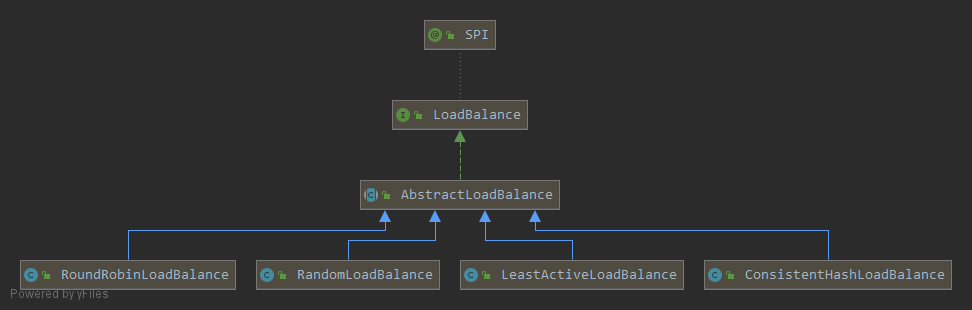

> Dubbo的Cluter会选择最合适的服务，供调用者使用。如何选取？  
>
> 1. ConsistentHash，Ketama一致性哈希算法。
> 2. Rondom，随机获取。
> 3. Roundbin，轮询选择。
> 4. leastActive，选择最近最少使用的节点。 
>    <!--more-->  

## AbastractLoadBlance

Dubbo各个模块都是通过模版模式进行灵活适配，路由模块也不例外。

AbastractLoadBlance实现LoadBalance接口，进行基础处理，如：权重获取、只有一个Invoker时，直接返回。

#### 模版处理

```java
@Override
public <T> Invoker<T> select(List<Invoker<T>> invokers, URL url, Invocation invocation) {
    if (CollectionUtils.isEmpty(invokers)) {
        return null;
    }
  	// 只存在一个服务节点，直接返回
    if (invokers.size() == 1) {
        return invokers.get(0);
    }
    return doSelect(invokers, url, invocation);
}
// 模板方法
protected abstract <T> Invoker<T> doSelect(List<Invoker<T>> invokers, URL url, Invocation invocation);
```

当有多个服务节点时，就需要同过选择的路由算法获取出合适的节点。doSelect模版方法的由对应的路由算法实现自己的特俗化处理。



#### 权重获取

权重的获取至关重要，Consisten Hash、Roundbin、Rondom、LeastActive都需要获取权重参与计算。

1. 获取对每个服务自定以的权重。如果没有配置，使用默认配置。
2. 获取预热时间（nowTime-startTime）、总预热时间。
3. 计算权重。

```java
// 获取权重
int getWeight(Invoker<?> invoker, Invocation invocation) {
		// 通过URL获取当前Invoker设置的权重
    int weight = invoker.getUrl().getMethodParameter(invocation.getMethodName(), WEIGHT_KEY, DEFAULT_WEIGHT);
    if (weight > 0) {
				// 获取启动的时间节点
        long timestamp = invoker.getUrl().getParameter(TIMESTAMP_KEY, 0L);
        if (timestamp > 0L) {
						// 求差值，得到已经预热时间
            long uptime = System.currentTimeMillis() - timestamp;
            if (uptime < 0) {
                return 1;
            }
						// 获取设置的总预热时间
            int warmup = invoker.getUrl().getParameter(WARMUP_KEY, DEFAULT_WARMUP);
            if (uptime > 0 && uptime < warmup) {
								// 计算出最后的权重
                weight = calculateWarmupWeight((int)uptime, warmup, weight);
            }
        }
    }
    return Math.max(weight, 0);
}
```

权重计算：（启动至今的时间/  给予的预热总时间）* 权重

```java
static int calculateWarmupWeight(int uptime, int warmup, int weight) {
    int ww = (int) ( uptime / ((float) warmup / weight));
    return ww < 1 ? 1 : (Math.min(ww, weight));
}
```

## Consistent Hash

Consistent Hash负载均衡可以让参数相同的请求每次路由到相同的机器上。

Ketama算法会为每个真实节点在创建多个虚拟节点，让节点在环形上的分布更加均匀，后续的调用也会随之更加均匀。

```java
ConsistentHashSelector(List<Invoker<T>> invokers, String methodName, int identityHashCode) {
    this.virtualInvokers = new TreeMap<Long, Invoker<T>>();
    this.identityHashCode = identityHashCode;
    URL url = invokers.get(0).getUrl();
    this.replicaNumber = url.getMethodParameter(methodName, HASH_NODES, 160);
    String[] index = COMMA_SPLIT_PATTERN.split(url.getMethodParameter(methodName, HASH_ARGUMENTS, "0"));
    argumentIndex = new int[index.length];
    for (int i = 0; i < index.length; i++) {
        argumentIndex[i] = Integer.parseInt(index[i]);
    }
		// 遍历所有的节点
    for (Invoker<T> invoker : invokers) {
				// 获得每个节点的IP
        String address = invoker.getUrl().getAddress();
				// replicaNumber是生成的虚拟节点数，默认为160个
        for (int i = 0; i < replicaNumber / 4; i++) {
						// 以IP+递增数字做MD5，以此作为节点标识
            byte[] digest = md5(address + i);
            for (int h = 0; h < 4; h++) {
                long m = hash(digest, h);
								// 对标识做“Hash”得到TreeMap的Key，以Invoker为value
                virtualInvokers.put(m, invoker);
            }
        }
    }
}
```


## Round Robin

权重轮询负载均衡会根据设置的权重来判断轮询的比例。

普通轮训负载均衡好处是每个节点获得的请求会很均匀，如果某些节点的负载能力很弱，则这个节点会堆积较多的请求。所以需要根据节点权重进行干预。

权重轮训

普通权重轮训：会造成某个节点突然被频繁选中，易造成某个节点流量暴增。

平滑权重轮训：在轮训时穿插训责其他节点，让整个服务器选择的过程比较均匀。

Dubbo的RoundRobin负载均衡算法采用的就是平滑权重轮训算法。

```java
@Override
protected <T> Invoker<T> doSelect(List<Invoker<T>> invokers, URL url, Invocation invocation) {
		// 生成key
    String key = invokers.get(0).getUrl().getServiceKey() + "." + invocation.getMethodName();
		// 查看缓存中是否存在
    ConcurrentMap<String, WeightedRoundRobin> map = methodWeightMap.get(key);
    if (map == null) {
				// 不存在，重新生成WeightedRoundRobin
        methodWeightMap.putIfAbsent(key, new ConcurrentHashMap<String, WeightedRoundRobin>());
        map = methodWeightMap.get(key);
    }
		// 权重总和
    int totalWeight = 0;
		// 最大的Current，默认为最小值
    long maxCurrent = Long.MIN_VALUE;
    long now = System.currentTimeMillis();
    Invoker<T> selectedInvoker = null;
    WeightedRoundRobin selectedWRR = null;
		// 遍历服务提供者，获取权重
    for (Invoker<T> invoker : invokers) {
        String identifyString = invoker.getUrl().toIdentityString();
        WeightedRoundRobin weightedRoundRobin = map.get(identifyString);
			/**************************************************************/
			/**************************************************************/
			/********将所有的Invoker的权重封装成WeightedRoundRobin对象**********/
			/**************************************************************/
			/**************************************************************/
				// 获取预热权重
        int weight = getWeight(invoker, invocation);

        if (weightedRoundRobin == null) {
            weightedRoundRobin = new WeightedRoundRobin();
            weightedRoundRobin.setWeight(weight);
            map.putIfAbsent(identifyString, weightedRoundRobin);
        }
				// 如果预热权重和和invoker设置的权重不相等，说明还在预热阶段，此时以预热权重为准。
        if (weight != weightedRoundRobin.getWeight()) {
            //weight changed
            weightedRoundRobin.setWeight(weight);
        }
				// 平滑轮询
				// 每个invoker会把权重加到自己的current属性上，并更新当前invoekr的lastUpdate属性。
				// current = current + weight;
        long cur = weightedRoundRobin.increaseCurrent();
				// 设置最后一次更新时间
        weightedRoundRobin.setLastUpdate(now);
				// 选取current最大的节点
        if (cur > maxCurrent) {
            maxCurrent = cur;
            selectedInvoker = invoker;
            selectedWRR = weightedRoundRobin;
        }
				// 累加每个Invoker的权重
        totalWeight += weight;
    }
		// 根据权重更新缓存
		// 由于所有的Invoker都会封装成为weightedRoundRobin对象，
    // 因为可以调用的invoker数量和缓存weightedRoundRobin对象的Map大小不相等，则说明缓存中有无用的数据。
    if (!updateLock.get() && invokers.size() != map.size()) {
				// 利用CAS抢占锁
        if (updateLock.compareAndSet(false, true)) {
            try {
                // copy -> modify -> update reference
                ConcurrentMap<String, WeightedRoundRobin> newMap = new ConcurrentHashMap<>(map);
                // 根据lastUpdate更新过期数据
								newMap.entrySet().removeIf(item -> now - item.getValue().getLastUpdate() > RECYCLE_PERIOD);
                // 修改指针引用
								methodWeightMap.put(key, newMap);
            } finally {
                updateLock.set(false);
            }
        }
    }
		// 返回Invoker。将当前Invoker的current减去总权重。
    if (selectedInvoker != null) {
        selectedWRR.sel(totalWeight);
        return selectedInvoker;
    }
    // should not happen here
    return invokers.get(0);
}
```

#### WeightedRoundRobin

```java
protected static class WeightedRoundRobin {
		// invoker设定的权重
    private int weight;
		// 考虑到并发场景下某个Invoker会被同时选中，表示该节点被所有线程选中的权重总和
    private AtomicLong current = new AtomicLong(0);
		// 最后一次更新时间，用于后续缓存超时的判断
    private long lastUpdate;
    public int getWeight() {
        return weight;
    }
    public void setWeight(int weight) {
        this.weight = weight;
        current.set(0);
    }
    public long increaseCurrent() {
        return current.addAndGet(weight);
    }
    public void sel(int total) {
        current.addAndGet(-1 * total);
    }
    public long getLastUpdate() {
        return lastUpdate;
    }
    public void setLastUpdate(long lastUpdate) {
        this.lastUpdate = lastUpdate;
    }
}
```

## Random

Random负载均衡是按照权重设置随机概率做负载均衡。 

1. 求出invokers权重总和。

2. 根据总权重计算出一个随机的偏移量。
3. 偏移量轮循键每个invoker的权重，如果偏移量小于0，就选中当前Invoeker。

```java
@Override
protected <T> Invoker<T> doSelect(List<Invoker<T>> invokers, URL url, Invocation invocation) {
    // Number of invokers
    int length = invokers.size();
    // Every invoker has the same weight?
		// 所有invoker拥有相同的权重
    boolean sameWeight = true;
    // the weight of every invokers
		// 生命一个权重数组，用于存放所有invoker的权重
    int[] weights = new int[length];
    // the first invoker's weight
		// 获取第一个Invoker的权重
    int firstWeight = getWeight(invokers.get(0), invocation);
    weights[0] = firstWeight;
    // The sum of weights
		// invokers权重总和
    int totalWeight = firstWeight;
    for (int i = 1; i < length; i++) {
				// 获取权重
        int weight = getWeight(invokers.get(i), invocation);
        // save for later use
        weights[i] = weight;
        // Sum
				// invokers权重进行加和
        totalWeight += weight;
				// 判断invokers是否拥有相同的权重
        if (sameWeight && weight != firstWeight) {
            sameWeight = false;
        }
    }
		// 所有的invoekr权重不同
    if (totalWeight > 0 && !sameWeight) {
        // If (not every invoker has the same weight & at least one invoker's weight>0), select randomly based on totalWeight.
        // 根据总权重计算出一个随机的偏移量，此处使用了ThreadLocalRandom性能会更好
				int offset = ThreadLocalRandom.current().nextInt(totalWeight);
        // Return a invoker based on the random value.
				// 遍历所有的Invoker，轮询减去权重。得到被选中的Invoker
        for (int i = 0; i < length; i++) {
            offset -= weights[i];
            if (offset < 0) {
                return invokers.get(i);
            }
        }
    }
    // If all invokers have the same weight value or totalWeight=0, return evenly.
		// 如果所有的权重相同，随机获取一个Invoker
    return invokers.get(ThreadLocalRandom.current().nextInt(length));
}
```


## Least Active

Least Active负载均衡称为最少活动调用数负载均衡，框架会记下每个Invoker的活跃数，每次只取活跃数最少的Invoker。

```java
@Override
protected <T> Invoker<T> doSelect(List<Invoker<T>> invokers, URL url, Invocation invocation) {
    // Number of invokers
    int length = invokers.size();
    // The least active value of all invokers
    int leastActive = -1;
    // The number of invokers having the same least active value (leastActive)
    int leastCount = 0;
    // The index of invokers having the same least active value (leastActive)
    int[] leastIndexes = new int[length];
    // the weight of every invokers
    int[] weights = new int[length];
    // The sum of the warmup weights of all the least active invokers
    int totalWeight = 0;
    // The weight of the first least active invoker
    int firstWeight = 0;
    // Every least active invoker has the same weight value?
    boolean sameWeight = true;


    // Filter out all the least active invokers
    for (int i = 0; i < length; i++) {
        Invoker<T> invoker = invokers.get(i);
				// 获得invoker的活跃数和预热权重
        // Get the active number of the invoker
        int active = RpcStatus.getStatus(invoker.getUrl(), invocation.getMethodName()).getActive();
        // Get the weight of the invoker's configuration. The default value is 100.
        int afterWarmup = getWeight(invoker, invocation);
        // save for later use
        weights[i] = afterWarmup;
        // 第一次执行或者发现更小的活跃数
				if (leastActive == -1 || active < leastActive) {
						// 置空之前的计数
            // Reset the active number of the current invoker to the least active number
            leastActive = active;
            // Reset the number of least active invokers
            leastCount = 1;
            // Put the first least active invoker first in leastIndexes
            leastIndexes[0] = i;
            // Reset totalWeight
            totalWeight = afterWarmup;
            // Record the weight the first least active invoker
            firstWeight = afterWarmup;
            // Each invoke has the same weight (only one invoker here)
            sameWeight = true;
            // If current invoker's active value equals with leaseActive, then accumulating.
						// 当前invoker的活跃数和计数相同，说明N个invoker都是最小计数，全部保存到集合中后续就在它们里面根据权重选取一个。
        } else if (active == leastActive) {
            // Record the index of the least active invoker in leastIndexes order
            leastIndexes[leastCount++] = i;
            // Accumulate the total weight of the least active invoker
            totalWeight += afterWarmup;
            // If every invoker has the same weight?
            if (sameWeight && i > 0
                    && afterWarmup != firstWeight) {
                sameWeight = false;
            }
        }
    }
    // Choose an invoker from all the least active invokers
		// 如果只有个invoker直接返回
    if (leastCount == 1) {
        // If we got exactly one invoker having the least active value, return this invoker directly.
        return invokers.get(leastIndexes[0]);
    }
		// 如果权重不一样，则使用和Random负载均衡一样的权重算法找到一个invoker并返回。
    if (!sameWeight && totalWeight > 0) {
        // If (not every invoker has the same weight & at least one invoker's weight>0), select randomly based on 
        // totalWeight.
        int offsetWeight = ThreadLocalRandom.current().nextInt(totalWeight);
        // Return a invoker based on the random value.
        for (int i = 0; i < leastCount; i++) {
            int leastIndex = leastIndexes[i];
            offsetWeight -= weights[leastIndex];
            if (offsetWeight < 0) {
                return invokers.get(leastIndex);
            }
        }
    }
		// 如果权重相同随机选取一个返回。
    // If all invokers have the same weight value or totalWeight=0, return evenly.
    return invokers.get(leastIndexes[ThreadLocalRandom.current().nextInt(leastCount)]);
}
```

## 总结

Dubbo的负载均衡是围绕权重进行计算的：

1. 一致性哈希利用了目前ketama哈希算法，redis的集群方案也有使用到。

2. rondom以总权重为线，每个invoker的权重为段，随机从总权重中获取一个游标offset，判断offset位于那一段，就返回该invoker。
3. Roundbin使用平滑权重轮循的数学原理。

#### 参考

<https://www.notion.so/Dubbo-ca1fd67df519464583c4a240244e239b#57b1bedf8e2c48be9c92380ddd721ced/>

