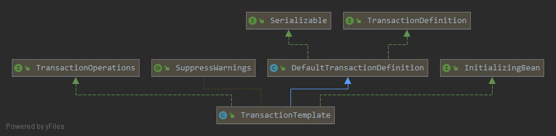
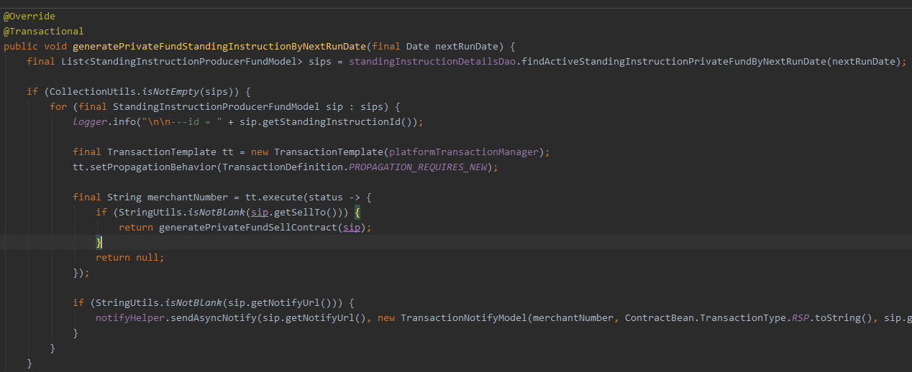
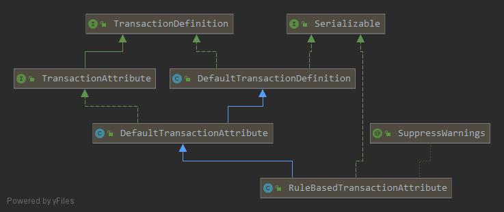
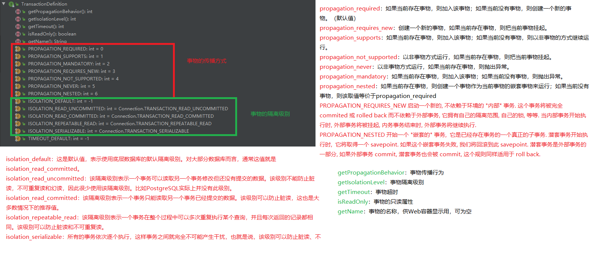
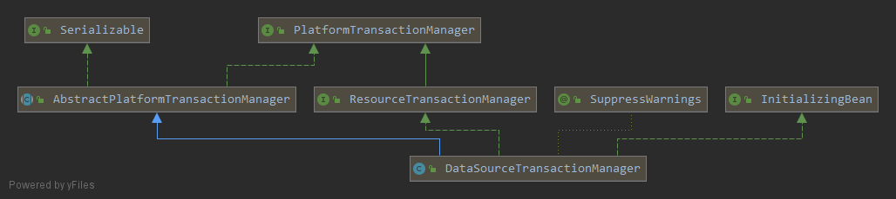
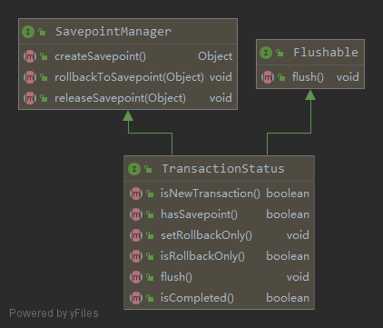
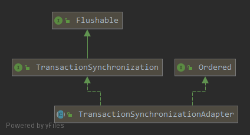

> Spring提供了两种编程式事物管理的方法：
>
> 1. 使用TransactionTemplate或者TransactionalOperator. 
>
> 2. 直接实现TransactionManager接口.  
>
> 如果是使用命令式编程，Spring推荐使用TransactionTemplate来完成编程式事务管理，如果是响应式编程，那么使用TransactionalOperator更加合适<!--more-->

# TransactionTemplate



TransactionTemplate的工作机制：实际上就是通过一个TransactionCallback封装了业务逻辑，然后TransactionTemplate会在事务的上下文中调用。而实际上有时候并不需要返回值，这种情况下，我们可以使用TransactionCallbackWithoutResult提代TransactionCallback。

## Eg1

TransactionTemplate完成事务处理，通过实现TransactionCallback接口并在其doInTransaction方法完成业务处理，使用如下图：



## TransactionTemplate#execute方法

TransactionTemplate是线程安全的，我们可以全局配置一个TransactionTemplate，然后所有的类都共享这个TransactionTemplate。

```java
@Override
@Nullable
public <T> T execute(TransactionCallback<T> action) throws TransactionException {
	Assert.state(this.transactionManager != null, "No PlatformTransactionManager set");

	if (this.transactionManager instanceof CallbackPreferringPlatformTransactionManager) {
		return ((CallbackPreferringPlatformTransactionManager) this.transactionManager).execute(this, action);
	}
	else {
		// 1.通过事物管理器开启事物
		TransactionStatus status = this.transactionManager.getTransaction(this);
		T result;
		try {
			//2.执行传入的业务逻辑
			result = action.doInTransaction(status);
		}
		catch (RuntimeException | Error ex) {
			// Transactional code threw application exception -> rollback
			// 出现异常，进行回滚
			rollbackOnException(status, ex);
			throw ex;
		}
		catch (Throwable ex) {
			// Transactional code threw unexpected exception -> rollback
			//// 出现异常，进行回滚
			rollbackOnException(status, ex);
			throw new UndeclaredThrowableException(ex, "TransactionCallback threw undeclared checked exception");
		}
		// 执行成功，提交事物
		this.transactionManager.commit(status);
		return result;
	}
}
```

#TransactionDefinition



描述对事务的属性，比如事物的传播方式，事物的隔离级别。



# TransactionManager接口

## PlatformTransactionManager



PlatformTransactionManager是命令式编程模型下Spring事物机制的中心接口，定义了完成一个事物必须的三个步骤。定义事物提交，回滚，获取事物状态的方法。

```java
public interface PlatformTransactionManager {

	
	TransactionStatus getTransaction(@Nullable TransactionDefinition definition) throws TransactionException;

	
	void commit(TransactionStatus status) throws TransactionException;

	void rollback(TransactionStatus status) throws TransactionException;

}
```

## AbstractPlatformTransactionManager

SYNCHRONIZATION_ALWAYS：默认为0

SYNCHRONIZATION_ON_ACTUAL_TRANSACTION：默认为1 

SYNCHRONIZATION_NEVER：默认为2

transactionSynchronization

defaultTimeout

nestedTransactionAllowed

validateExistingTransaction

globalRollbackOnParticipationFailure

failEarlyOnGlobalRollbackOnly

failEarlyOnGlobalRollbackOnly

```java
@Override
public final TransactionStatus getTransaction(@Nullable TransactionDefinition definition) throws TransactionException {
	Object transaction = doGetTransaction();

	// Cache debug flag to avoid repeated checks.
	boolean debugEnabled = logger.isDebugEnabled();

	if (definition == null) {
		// Use defaults if no transaction definition given.
		definition = new DefaultTransactionDefinition();
	}

	if (isExistingTransaction(transaction)) {
		// Existing transaction found -> check propagation behavior to find out how to behave.
		return handleExistingTransaction(definition, transaction, debugEnabled);
	}

	// Check definition settings for new transaction.
	if (definition.getTimeout() < TransactionDefinition.TIMEOUT_DEFAULT) {
		throw new InvalidTimeoutException("Invalid transaction timeout", definition.getTimeout());
	}

	//--------------propagation_mandatory----------------------//
	// No existing transaction found -> check propagation behavior to find out how to proceed.
	if (definition.getPropagationBehavior() == TransactionDefinition.PROPAGATION_MANDATORY) {
		throw new IllegalTransactionStateException(
				"No existing transaction found for transaction marked with propagation 'mandatory'");
	}
	//----------------------propagation_required/propagation_requires_new/propagation_nested--------------------//
	else if (definition.getPropagationBehavior() == TransactionDefinition.PROPAGATION_REQUIRED ||
			definition.getPropagationBehavior() == TransactionDefinition.PROPAGATION_REQUIRES_NEW ||
			definition.getPropagationBehavior() == TransactionDefinition.PROPAGATION_NESTED) {
		// 把当前事务挂起并保存当前事务的事务属性
		SuspendedResourcesHolder suspendedResources = suspend(null);
		if (debugEnabled) {
			logger.debug("Creating new transaction with name [" + definition.getName() + "]: " + definition);
		}
		try {
			boolean newSynchronization = (getTransactionSynchronization() != SYNCHRONIZATION_NEVER);
			DefaultTransactionStatus status = newTransactionStatus(
					definition, transaction, true, newSynchronization, debugEnabled, suspendedResources);
			// 初始化事务,钩子方法
			doBegin(transaction, definition);
			// 初始化事务同步
			prepareSynchronization(status, definition);
			return status;
		}
		catch (RuntimeException | Error ex) {
			resume(null, suspendedResources);
			throw ex;
		}
	}
	else {
		// Create "empty" transaction: no actual transaction, but potentially synchronization.
		if (definition.getIsolationLevel() != TransactionDefinition.ISOLATION_DEFAULT && logger.isWarnEnabled()) {
			logger.warn("Custom isolation level specified but no actual transaction initiated; " +
					"isolation level will effectively be ignored: " + definition);
		}
		boolean newSynchronization = (getTransactionSynchronization() == SYNCHRONIZATION_ALWAYS);
		// 创建新事务,注意:transaction参数为null,所以这里创建的不是一个真正的事务
		return prepareTransactionStatus(definition, null, true, newSynchronization, debugEnabled, null);
	}
}
```

```java
@Nullable
protected final SuspendedResourcesHolder suspend(@Nullable Object transaction) throws TransactionException {
	if (TransactionSynchronizationManager.isSynchronizationActive()) {
		List<TransactionSynchronization> suspendedSynchronizations = doSuspendSynchronization();
		try {
			Object suspendedResources = null;
			if (transaction != null) {
				//挂起事务,钩子方法
				suspendedResources = doSuspend(transaction);
			}
			String name = TransactionSynchronizationManager.getCurrentTransactionName();
			TransactionSynchronizationManager.setCurrentTransactionName(null);
			boolean readOnly = TransactionSynchronizationManager.isCurrentTransactionReadOnly();
			TransactionSynchronizationManager.setCurrentTransactionReadOnly(false);
			Integer isolationLevel = TransactionSynchronizationManager.getCurrentTransactionIsolationLevel();
			TransactionSynchronizationManager.setCurrentTransactionIsolationLevel(null);
			boolean wasActive = TransactionSynchronizationManager.isActualTransactionActive();
			TransactionSynchronizationManager.setActualTransactionActive(false);
			return new SuspendedResourcesHolder(
					suspendedResources, suspendedSynchronizations, name, readOnly, isolationLevel, wasActive);
		}
		catch (RuntimeException | Error ex) {
			// doSuspend failed - original transaction is still active...
			doResumeSynchronization(suspendedSynchronizations);
			throw ex;
		}
	}
	else if (transaction != null) {
		// Transaction active but no synchronization active.
		Object suspendedResources = doSuspend(transaction);
		return new SuspendedResourcesHolder(suspendedResources);
	}
	else {
		// Neither transaction nor synchronization active.
		return null;
	}
}
```

```java
private List<TransactionSynchronization> doSuspendSynchronization() {
  // 1.获取当前线程的所有事务同步回调
	List<TransactionSynchronization> suspendedSynchronizations =
			TransactionSynchronizationManager.getSynchronizations();
  // 2.循环并挂起所有同步回调接口
	for (TransactionSynchronization synchronization : suspendedSynchronizations) {
		synchronization.suspend();
	}
	// 3.清除资源
	TransactionSynchronizationManager.clearSynchronization();
	return suspendedSynchronizations;
}
```

##  

TransactionStatus



# TransactionSynchronizationManager同步事务

TransactionSynchronizationManager使用ThreadLocal来为不同的事物线程提供独立的资源副本，并且同时维护这些事物的配置属性和运行状态。

```java
// 线程上下文中保存着[线程池对象：ConnectHolder]的Map对象。线程可以通过该属性获取到同一个Connection对象
private static final ThreadLocal<Map<Object, Object>> resources = new NamedThreadLocal<>("Transactional resources");
// 事务同步器，自定义扩展方法，每个线程都可以注册N个事务同步器
private static final ThreadLocal<Set<TransactionSynchronization>> synchronizations = new NamedThreadLocal<>("Transaction synchronizations");
// 事务的名称
private static final ThreadLocal<String> currentTransactionName = new NamedThreadLocal<>("Current transaction name");
// 事务是否只读
private static final ThreadLocal<Boolean> currentTransactionReadOnly = new NamedThreadLocal<>("Current transaction read-only status");
// 事务的隔离级别
private static final ThreadLocal<Integer> currentTransactionIsolationLevel = new NamedThreadLocal<>("Current transaction isolation level");
// 事务是否开启
private static final ThreadLocal<Boolean> actualTransactionActive = new NamedThreadLocal<>("Actual transaction active");
```

## 事物信息绑定

在org.springframework.jdbc.datasource.DataSourceTransactionManager#doBegin中，DataSourceTransactionObject收判断是否为新建的，若是新增的，将对其进行绑定。TransactionSynchronizationManager.bindResource(obtainDataSource(), txObject.getConnectionHolder());

```java
public static void bindResource(Object key, Object value) throws IllegalStateException {
	Object actualKey = TransactionSynchronizationUtils.unwrapResourceIfNecessary(key);
	Assert.notNull(value, "Value must not be null");
	Map<Object, Object> map = resources.get();
	// set ThreadLocal Map if none found
	if (map == null) {
		map = new HashMap<>();
		resources.set(map);
	}
	Object oldValue = map.put(actualKey, value);
	// Transparently suppress a ResourceHolder that was marked as void...
	if (oldValue instanceof ResourceHolder && ((ResourceHolder) oldValue).isVoid()) {
		oldValue = null;
	}
	if (oldValue != null) {
		throw new IllegalStateException("Already value [" + oldValue + "] for key [" +
				actualKey + "] bound to thread [" + Thread.currentThread().getName() + "]");
	}
	if (logger.isTraceEnabled()) {
		logger.trace("Bound value [" + value + "] for key [" + actualKey + "] to thread [" +
				Thread.currentThread().getName() + "]");
	}
}
```

## 初始化事物同步器

在TransactionInterceptor中，执行invoke，对事物方法进行拦截处理。由父类org.springframework.transaction.interceptor.TransactionAspectSupport#invokeWithinTransaction实际执行过程中，调用TransactionInfo txInfo = createTransactionIfNecessary(tm, txAttr, joinpointIdentification);创建TransactionInfo时，会调用AbstractPlatformTransactionManager#prepareSynchronization方法初始化事务同步器。

### 创建TransactionInfo

```java
protected TransactionInfo createTransactionIfNecessary(@Nullable PlatformTransactionManager tm,
		@Nullable TransactionAttribute txAttr, final String joinpointIdentification) {

	// If no name specified, apply method identification as transaction name.
	if (txAttr != null && txAttr.getName() == null) {
		txAttr = new DelegatingTransactionAttribute(txAttr) {
			@Override
			public String getName() {
				return joinpointIdentification;
			}
		};
	}

	TransactionStatus status = null;
	if (txAttr != null) {
		if (tm != null) {
			// 获取TransactionStatus
			status = tm.getTransaction(txAttr);
		}
		else {
			if (logger.isDebugEnabled()) {
				logger.debug("Skipping transactional joinpoint [" + joinpointIdentification +
						"] because no transaction manager has been configured");
			}
		}
	}
	// 通过制定的属性和状态创建TransactionInfo
	return prepareTransactionInfo(tm, txAttr, joinpointIdentification, status);
}
```

通过制定的属性和状态创建TransactionInfo

```java
protected TransactionInfo prepareTransactionInfo(@Nullable PlatformTransactionManager tm,
		@Nullable TransactionAttribute txAttr, String joinpointIdentification,
		@Nullable TransactionStatus status) {

	TransactionInfo txInfo = new TransactionInfo(tm, txAttr, joinpointIdentification);
	if (txAttr != null) {
		// We need a transaction for this method...
		if (logger.isTraceEnabled()) {
			logger.trace("Getting transaction for [" + txInfo.getJoinpointIdentification() + "]");
		}
		// The transaction manager will flag an error if an incompatible tx already exists.
		txInfo.newTransactionStatus(status);
	}
	else {
		// The TransactionInfo.hasTransaction() method will return false. We created it only
		// to preserve the integrity of the ThreadLocal stack maintained in this class.
		if (logger.isTraceEnabled())
			logger.trace("Don't need to create transaction for [" + joinpointIdentification +
					"]: This method isn't transactional.");
	}

	// We always bind the TransactionInfo to the thread, even if we didn't create
	// a new transaction here. This guarantees that the TransactionInfo stack
	// will be managed correctly even if no transaction was created by this aspect.
	// 绑定TransactionInfo 
	txInfo.bindToThread();
	return txInfo;
}
```

## 初始化事物同步器

```java
/**
 * Initialize transaction synchronization as appropriate.
 */
protected void prepareSynchronization(DefaultTransactionStatus status, TransactionDefinition definition) {
	if (status.isNewSynchronization()) {
		TransactionSynchronizationManager.setActualTransactionActive(status.hasTransaction());
		TransactionSynchronizationManager.setCurrentTransactionIsolationLevel(
				definition.getIsolationLevel() != TransactionDefinition.ISOLATION_DEFAULT ?
						definition.getIsolationLevel() : null);
		TransactionSynchronizationManager.setCurrentTransactionReadOnly(definition.isReadOnly());
		TransactionSynchronizationManager.setCurrentTransactionName(definition.getName());
		TransactionSynchronizationManager.initSynchronization();
	}
}
```

## TransactionSynchronization



事物同步的扩展点，用于事物同步回调的接口

```java
public abstract class TransactionSynchronizationAdapter implements TransactionSynchronization, Ordered {

	@Override
	public int getOrder() {
		return Ordered.LOWEST_PRECEDENCE;
	}

	// 事务挂起
	@Override
	public void suspend() {
	}

	//事务恢复
	@Override
	public void resume() {
	}

  // 将基础会话刷新到数据存储区（如果适用）
	@Override
	public void flush() {
	}

	// 在事务提交前触发，此处若发生异常，会导致回滚
	@Override
	public void beforeCommit(boolean readOnly) {
	}

  // 在beforeCommit之后，commit/rollback之前执行。即使异常，也不会回滚
	@Override
	public void beforeCompletion() {
	}

  // 事务提交后执行
	@Override
	public void afterCommit() {
	}

  // 事务提交/回滚执行
	@Override
	public void afterCompletion(int status) {
	}

}
```