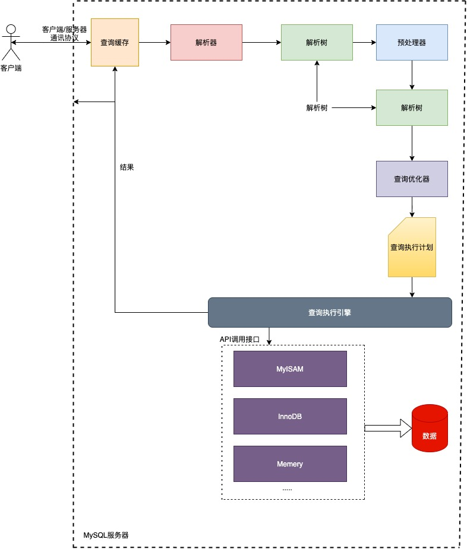

> 在平时的开发操作中，会写出一些慢SQL，只是知道如何避免慢SQL，但是没有具体的了解慢SQL的衡量标准，它为什么会导致查询效率的缓存，只有了解慢SQL产生的原因，才能更好的避免写出慢SQL。 <!-- more -->

# 慢查询是如何产生的

慢查询产生的原因可以分为两个大类主动和被动（自我理解），主动就是在写SQL时业务逻辑处理不清晰导致的，被动就是逻辑清晰但是SQL的查询方式需要优化，简单的说就是业务能力与技术能力产生。

通常由以下问题导致慢查询：

1. 查询不需要的记录
2. 多表关联时返回全部列
3. 总是取出全部列
4. 重复查询相同的数据

衡量慢查询的指标：

1. 响应时间
2. 扫描的行数
3. 返回的行数

响应时间是指服务时间和排队时间。排队时间是指数据库处理了这个慢查询真正花费的时间。排队时间是指服务器因为等待某些资源而没有真正执行查询的时间（I/O或锁等）。

在不同的应用压力下，响应时间是没有规律的，响应时间会受存储引擎的锁、高并发资源竞争、响应时间等因素影响。

扫描的行数和返回的行数在理想理想情况下是1:1，但是在生产中却是相反的。

# 了解查询执行的过程

 

## 通讯协议

MySQL客户端和服务器之间的通信协议是"半双工"的，所以在任何一个时刻，要么是客户端向服务器发送数据，要么是服务端向客户端发送数据，两个动作不能同时发生。

多数连接MySQL的库函数都可以获的全部结果并缓存到内存里，还可以逐行获取需要的数据。默认一般是获的全部结果集并缓存到内存中。MySQL通常需要等待所有的数据都已经发送给客户端才能释放这条查询所占用的资源，所以接受全部结果并缓存通常可以减少服务器的压力，让查询能够早点结束、早点释放相应的资源。

```sql
select * from test; 
```

在test表中有1000万条数据，将查询的结果集进行缓存会花费大量的时间和内存，消耗内存的成本大于时间成本，可以考虑不适用缓存。

```sql
Show full processlist;
```

## 查询的状态

查看当前线程的状态。

| 状态                           |                                                              |
| ------------------------------ | ------------------------------------------------------------ |
| Sleep                          | 线程正在等待客户端发送新的请求。                             |
| Query                          | 线程正在执行查询或者正在将结果发送给客户端。                 |
| Locked                         | 该线程正在等待锁                                             |
| Analyzing and statistics       | 线程正在收集存储引擎的统计信息，并生成查询的执行计划。       |
| Copying to tmp table [on disk] | 线程正在执行查询，并且将其结果集都复制到一个临时表中。       |
| Sorting resule                 | 线程正在对结果集进行排序。                                   |
| Sending data                   | 线程可能在多个状态之间传递数据，或者在生成结果集，活在在向客户端返回结果集。 |

## 查询缓存

在解析一个查询语句之前，如果查询缓存是打开的，MySQL会根据一个对大小写敏感的哈希从缓存中优先查询，如果命中了缓存，会直接从缓存中获取结果并返回给客户端。

##查询优化处理

查询优化包含多个字阶段：解析SQL、预处理、优化SQL执行计划。

## 语法解析其和预处理

MySQL通过关键字将SQL语法解析，并生成一棵对应的“解析树”，MySQL解析器将使用MySQL语法规则验证和解析查询。

## 查询优化器

一条查询可以有很多种执行方式，最后都返回相同的结果。优化器的作用就是找到其中最好的执行计划。

需要另作一片文章进行讨论。

## 执行计划

MySQL生成查询的一棵指令树，然后通过存储引擎执行完成这棵指令树并返回结果。

MySQL总是从一个表开始一直嵌套循环、回溯完成所有表关联。MySQL的执行计划是一刻左测深度优先的树。

## 查询执行引擎

MySQL根据执行计划的指令逐步执行。在根绝执行计划逐步执行的过程中，有大量的操作需要通过调用存储引擎实现的接口完成，即”handler API“接口。查询中的每一个表由一个handler的实例表示。

## 返回结果给客户端

查询执行的最后一阶段是将结果返回给客户端。即使查询不需要返回结果集给客户端，MySQL任会返回查询的一些信息。

MySQL将结果集返回客户端是一个增量、逐步返回的过程。这样做服务器端无须存储太多的结果，减少内存的消耗；MySQL客户端第一时间获得返回的结果。

# 慢查询产生的环节

慢查询可能是坏SQL导致查询优化器无法优化，执行引擎执行缓慢，所以我们要加深对查询优化器的理解。
