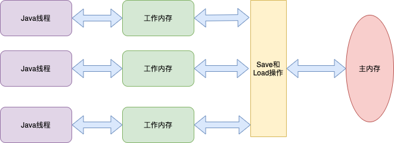
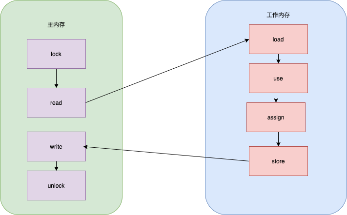

> 今天和老大聊JVM内存模型，一开口，老大就指出我把JVM内存模型和Java虚拟机运行时数据区搞反了，在网上翻了很多博客，发现都搞反了，翻了[ JSR-133: Java Memory Model and Thread Specification ](http://www.cs.umd.edu/~pugh/java/memoryModel/jsr133.pdf)和《深入JVM虚拟机》才了解具体的定义。<!-- more -->

# 内存模型概念

Java内存模型的主要目标是定义程序中各个变量的访问规则。即在虚拟机中将变量存储到内存和从内存中取出变量这样的底层细节。

主内存：存储Java所有的变量

工作内存：每条线程都有自己的工作内存，其中保留了被该线程使用到的变量的主内存副本拷贝，线程对变量的所有操作（读取和赋值等）都必须在工作内存中进行，而不能直接读写主内存中的变量。 

不同的线程之间无法直接访问对方的工作内存中的变量，线程间变量值的传递均需要通过主内存来完成。

# 内存间如何交互

程序需要对主内存中的testA=1变量进行访问时，如果为了保证并发修改问题：

1. 先对主内存中的testA=1进行lock加锁。（lock）

2. 读取主内存中的变量testA并将其传输到线程的工作内存中。（read）

3. 把从主内存得到的testA变量放入工作内存的变量副本中。（load）

4. 当有执行引擎需要这个值时，将工作内存中的testA变量传递给调用者。（use）

5. 执行引擎对testA=1重新赋值为testA=2。（assign）
6. 如果对工作内存中的变量重新复制操作（assign），必须将工作内存的testA=2同步到write。如果没有发生任何assign操作，则不允许进行同步操作。（store）
7. 将同步到主内存的testA=2写入到主内存的变量testA中。
8. 在执行unlock操作前，必须把变量同步写入到主内存中。unlock和lock的执行次数一致。

对于大部分的数据并发竞争问题适用（synchronized），但是volatile有自己的特殊规则。

# 特殊规则- volatile变量

当一个变量定于为volatile，它将具备两种特性：

1. 保证此变量对所有线程可见性。

   在各个线程的工作内存中，volatile变量也可以存在不一致的情况，但由于每次使用之前都要刷新，执行引擎看不到不一致的情况，因此可以任务不存在一致性问题。但是Java里面的运算并非原子操作，导致volatile变量的运算在并发下一样时不安全的。

   由于volatile变量只能保证可见性，在不符合以下的两条规则的运算场景下，可以通过加锁（synchronize/原子类）来保证并发性。

   I	运算结果并不依赖变量的当前值，或者能够确保只有单一的线程修改变量的值。

   II   变量不需要与其他的状态变量共同参与不变约束。

2. 禁止指令重排序优化，普通的变量仅仅会保证在该方法的执行过程中所有依赖赋值结果的都能获取到正确的结果，而不能保证变量赋值时操作的顺序与程序代码中的执行顺序一致。

   在写操作插入许多内存屏障来保证处理器不发生乱序执行。

   

# 模型解决了什么问题

Java的内存模型保证在并发过程中处理问题的原子性、可见性、有序性。

原子性：Lock/unlock，synchronize的monitorenter/monitorexit满足原子性的需求。

可见性：volatile/synchronize/final保证了可见性。

有序性：

1. volatile的禁止指令重排序语义。
2. synchronize的一个变量在同一时刻只允许一条线程对其进行lock操作。
3. 先行发生原则。

