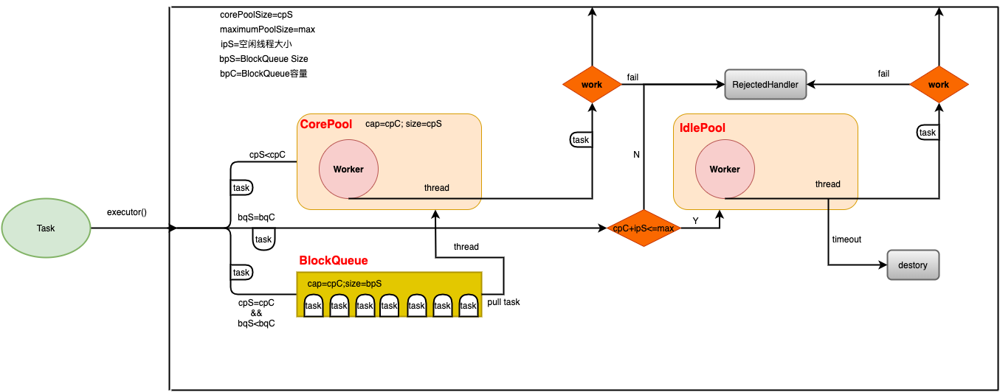
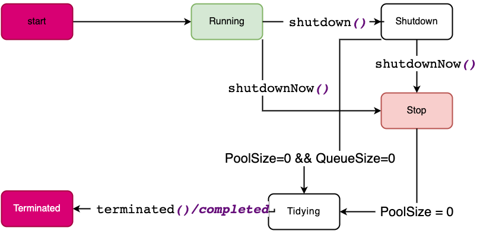
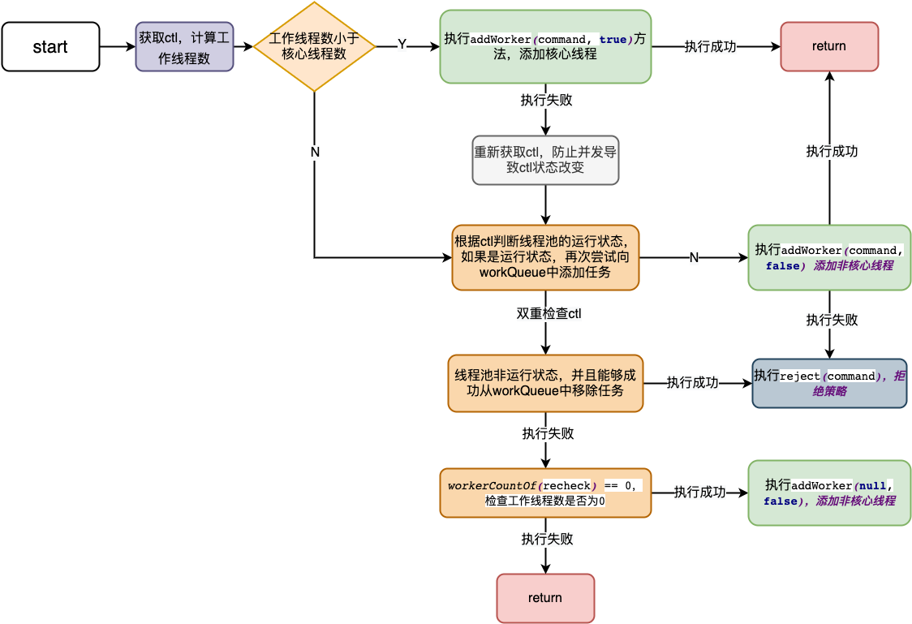
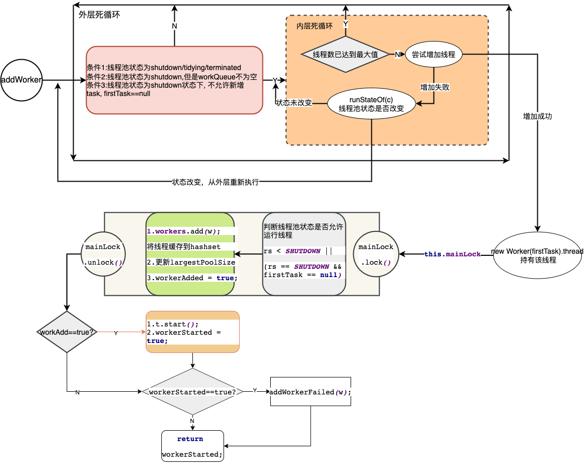
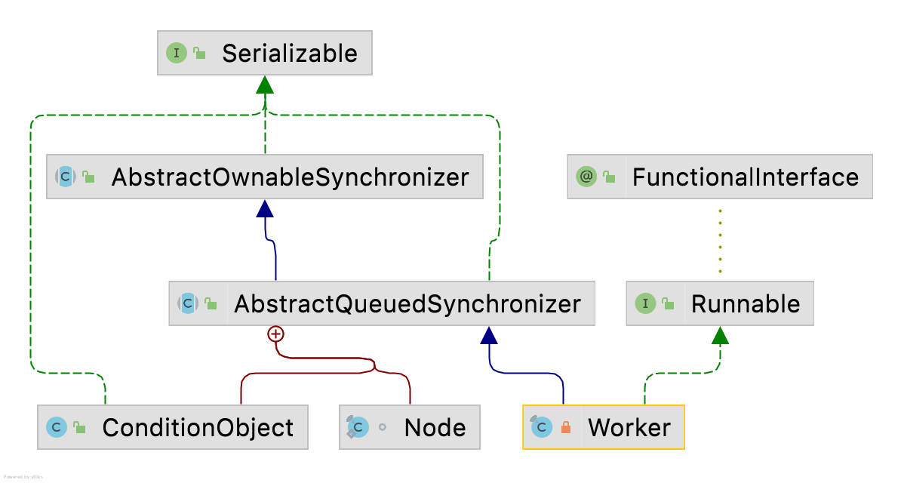

> 创建线程池的方式有Executors和ThreadPoolExecutorl两种方式；ThreadPoolExecutor是作为最基础的创建方式，再次整理加深了解！<!-- more -->




# 成员变量

```java
private final AtomicInteger ctl = new AtomicInteger(ctlOf(RUNNING, 0));
// Integer.SIZE 32位
private static final int COUNT_BITS = Integer.SIZE - 3;
//2^29 - 1
private static final int CAPACITY   = (1 << COUNT_BITS) - 1;

private static final int RUNNING    = -1 << COUNT_BITS;
private static final int SHUTDOWN   =  0 << COUNT_BITS;
private static final int STOP       =  1 << COUNT_BITS;
private static final int TIDYING    =  2 << COUNT_BITS;
private static final int TERMINATED =  3 << COUNT_BITS;

private static int runStateOf(int c)     { return c & ~CAPACITY; }
private static int workerCountOf(int c)  { return c & CAPACITY; }
private static int ctlOf(int rs, int wc) { return rs | wc; }
```

## 线程状态变量

```java
                            0000 0000 0000 0000 0000 0000 0000 0000
        
RUNNING                     1110 0000 0000 0000 0000 0000 0000 0000       -1<<29
               
SHUTDOWN                    0000 0000 0000 0000 0000 0000 0000 0000       0<<29
               
STOP                        0010 0000 0000 0000 0000 0000 0000 0000       1<<29
               
                            0000 0000 0000 0000 0000 0000 0000 0010       2
TIDYING                     0100 0000 0000 0000 0000 0000 0000 0000       2<<29
               
                            0000 0000 0000 0000 0000 0000 0000 0011       3
TERMINATED                  0110 0000 0000 0000 0000 0000 0000 0000       3<<29
               
                            1110 0000 0000 0000 0000 0000 0000 0000
                                                                  ｜
                            0000 0000 0000 0000 0000 0000 0000 0000    
ctlOf                   =   1110 0000 0000 0000 0000 0000 0000 0000                            
```

COUNT_BITS：概念上用于表示状态位与线程数位的分界值，实际用于状态变量等移位操作。

CAPACITY：表示 ThreadPoolExecutor 的最大容量。最大容量即低29位全部为1。

由上可以看出，-1、0、1、2、3的左移29位的区别都在高3位，所以用高3位代表线程的状态。

ctl 在一个int中包装了活跃线程数和线程池运行时状态两个变量。高3位代表线程的状态，低29位用来表示线程池的容量。

## 剖离ctl

runStateOf 获取线程池状态。

```java
CAPACITY                    0001 1111 1111 1111 1111 1111 1111 1111
                              			                              
~CAPACITY                   1110 0000 0000 0000 0000 0000 0000 0000
                                                                  &
ctl                         0110 0101 0000 0000 0000 0000 0000 0000      （ctl任意赋予的值）
runStateOf                  0110 0000 0000 0000 0000 0000 0000 0000
```

workerCountOf 获取线程活跃线程数

```java
CAPACITY                    0001 1111 1111 1111 1111 1111 1111 1111
                                                                  &
ctl                         0110 0101 0000 0000 0000 0000 0000 0000      （ctl任意赋予的值）
runStateOf                  0000 0101 0000 0000 0000 0000 0000 0000  
```

任何值与0等于0，与1等于原值。因此 ‘与’ 操作过后，ctl 的高3位保留原值，低29位置0。使用这种方式巧妙的方式将线程池状态与活跃线程数剥离开。

## 生命周期




# execute执行流程


```java
public void execute(Runnable command) {
    if (command == null)
        throw new NullPointerException();
    // 获取 ctl 的值，ctl = (runState + workerCount)
    int c = ctl.get();
    // 如果工作线程数小于线程池核心线程大小,添加核心线程
    if (workerCountOf(c) < corePoolSize) {
        if (addWorker(command, true))
            // 添加成功，直接返回
            return;
        // 添加失败，重新获取ctl
        c = ctl.get();
    }
    // 在线程池已满的情况下，如果线程池是运行状态，尝试将任务添加至队列。
    if (isRunning(c) && workQueue.offer(command)) {
        // 再次获取 ctl 的值，进行双重认证
        int recheck = ctl.get();
        // 如果线程池非运行状态，尝试从队列中移除任务
        if (! isRunning(recheck) && remove(command))
            reject(command);
        // 如果线程池为运行状态、或移除任务失败
        else if (workerCountOf(recheck) == 0)
        // 执行 addWorker 方法，此时添加的是非核心线程（空闲线程，有存活时间）
            addWorker(null, false);
    }
    // 如果线程池是非运行状态或者workQueue添加任务失败，再次尝试 addWorker() 方法
    else if (!addWorker(command, false))
        //workQueue添加失败，执行拒绝策略。
        reject(command);
}
```





## method::reject


```java
final void reject(Runnable command) {
    handler.rejectedExecution(command, this);
}
```

执行拒绝策略，调用RejectedExecutionHandler类，使用策略模式，根据配置，执行具体的策略。


## method::addWorker


```java
private boolean addWorker(Runnable firstTask, boolean core) {
    retry:
    for (;;) {
        int c = ctl.get();
        // 获取线程池的运行状态
        int rs = runStateOf(c);

        // Check if queue empty only if necessary.
        // 如果 rs > SHUTDOWN，此时不允许接收新任务，也不允许执行工作队列中的任务，直接返回fasle。
        // 如果 rs == SHUTDOWN，任务为null，并且工作队列不为空，此时走下面的 '执行工作队列中任务' 的逻辑。
        // 这里设置 firstTask == null 是因为：线程池在SHUTDOWN状态下，不允许添加新任务，只允许执行工作队列中剩余的任务。
        if (rs >= SHUTDOWN &&
            ! (rs == SHUTDOWN &&
               firstTask == null &&
               ! workQueue.isEmpty()))
            return false;

        for (;;) {
            // 获取工作线程数
            int wc = workerCountOf(c);
            // 工作线程大于容量  工作线程小于最大线程数
            if (wc >= CAPACITY ||
                wc >= (core ? corePoolSize : maximumPoolSize))
                return false;
            // 尝试增加核心线程数，失败从头开始循环执行
            if (compareAndIncrementWorkerCount(c))
                break retry;
            c = ctl.get();  // Re-read ctl
            if (runStateOf(c) != rs)
                continue retry;
            // else CAS failed due to workerCount change; retry inner loop
        }
    }

    boolean workerStarted = false;
    boolean workerAdded = false;
    Worker w = null;
    try {
        // 创建worker线程，每一个Worker内持有真正执行任务的线程。
        w = new Worker(firstTask);
        final Thread t = w.thread;
        if (t != null) {
            final ReentrantLock mainLock = this.mainLock;
            mainLock.lock();
            try {
                // 获取run state
                int rs = runStateOf(ctl.get());
                // 1.运行状态，则创建worker线程
                // 2.如果为 SHUTDOWN 状态，并且 firstTask == null，此时将创建线程执行 任务队列 中的任务。
                if (rs < SHUTDOWN ||
                    (rs == SHUTDOWN && firstTask == null)) {
                    if (t.isAlive()) // precheck that t is startable
                        throw new IllegalThreadStateException();
                    workers.add(w);
                    int s = workers.size();
                    if (s > largestPoolSize)
                        largestPoolSize = s;
                    workerAdded = true;
                }
            } finally {
                // 解锁
                mainLock.unlock();
            }
            if (workerAdded) {
                t.start();
                workerStarted = true;
            }
        }
    } finally {
        if (! workerStarted)
            addWorkerFailed(w);
    }
    return workerStarted;
}
```

addWorker重要节点：

1. 通过两层死循环和CAS保证compareAndIncrementWorkerCount(c)更新活跃线程数。
   1. 在什么情况下才能够更新活跃线程数呢？
      1. 线程池状态是runing/stop状态才。
      2. 线程池状态是shutdown，但是在workQueue中依然有待执行的任务，firstTask==null。
      3. 活跃线程数小于线程池容量。
      4. 活跃线程数要小于核心线程数或线程池最大线程数。



## method::compareAndIncrementWorkerCount

```java
    private boolean compareAndIncrementWorkerCount(int expect) {
        return ctl.compareAndSet(expect, expect + 1);
    }
```

通过CAS命令的方式令ctl中低29位线程活跃数+1。

##  method::addWorkerFailed

```java
    private void addWorkerFailed(Worker w) {
        final ReentrantLock mainLock = this.mainLock;
        mainLock.lock();
        try {
            if (w != null)
             // 从缓存中移除worker
                workers.remove(w);
            // 
            decrementWorkerCount();
            tryTerminate();
        } finally {
            mainLock.unlock();
        }
    }
    
     /**
     * Decrements the workerCount field of ctl. This is called only on
     * abrupt termination of a thread (see processWorkerExit). Other
     * decrements are performed within getTask.
     */
    private void decrementWorkerCount() {
        do {} while (! compareAndDecrementWorkerCount(ctl.get()));
    }

```


## tryTerminate

```
    final void tryTerminate() {
        for (;;) {
            int c = ctl.get();
            if (isRunning(c) ||
                runStateAtLeast(c, TIDYING) ||
                (runStateOf(c) == SHUTDOWN && ! workQueue.isEmpty()))
                return;
            if (workerCountOf(c) != 0) { // Eligible to terminate
                interruptIdleWorkers(ONLY_ONE);
                return;
            }

            final ReentrantLock mainLock = this.mainLock;
            mainLock.lock();
            try {
                if (ctl.compareAndSet(c, ctlOf(TIDYING, 0))) {
                    try {
                        terminated();
                    } finally {
                        ctl.set(ctlOf(TERMINATED, 0));
                        termination.signalAll();
                    }
                    return;
                }
            } finally {
                mainLock.unlock();
            }
            // else retry on failed CAS
        }
    }
```


# 内部类::Worker

```java
    private final class Worker
        extends AbstractQueuedSynchronizer
        implements Runnable
    {
        private static final long serialVersionUID = 6138294804551838833L;

        // 工作线程
        final Thread thread;
        // 提交的待执行任务
        Runnable firstTask;
        
        // volatile 保证线程的可见性，已经完成的线程任务量
        volatile long completedTasks;

        Worker(Runnable firstTask) {
           // 初始化状态
            setState(-1); 
           // 需要执行的任务
            this.firstTask = firstTask;
           // 利用线程创建工厂创建线程
            this.thread = getThreadFactory().newThread(this);
        }

        /** Delegates main run loop to outer runWorker  */
        public void run() {
           // 真正执行逻辑的细胞方法runWorker
            runWorker(this);
        }

        // Lock methods
        //
        // The value 0 represents the unlocked state.
        // The value 1 represents the locked state.

        //AQS框架
        protected boolean isHeldExclusively() {
            return getState() != 0;
        }

        protected boolean tryAcquire(int unused) {
            // 使用CAS将0变成1
            if (compareAndSetState(0, 1)) {
                //排他锁 设置当前线程独占
                setExclusiveOwnerThread(Thread.currentThread());
                return true;
            }
            return false;
        }

        // 释放线程
        protected boolean tryRelease(int unused) {
            setExclusiveOwnerThread(null);
            setState(0);
            return true;
        }

        public void lock()        { acquire(1); }
        public boolean tryLock()  { return tryAcquire(1); }
        public void unlock()      { release(1); }
        public boolean isLocked() { return isHeldExclusively(); }

        void interruptIfStarted() {
            Thread t;
            if (getState() >= 0 && (t = thread) != null && !t.isInterrupted()) {
                try {
                    t.interrupt();
                } catch (SecurityException ignore) {
                }
            }
        }
    }
```


Worker继承了AbstractQueuedSynchronizer实现了Runnable接口。(所以呢？暂时对AQS了解不够深入！)



AbstractQueuedSynchronizer:


Runable:

调用run()方法，具体执行的是runWorker(this);

在创建每一个worker时，会初始化RUNNING(-1)状态、待执行的任务(firstTask)，并为worker对象绑定一个线程(通过ThreadFactory创建)，在线程池中任务的运行不是直接执行run()方法，而是执行Worker中run方法，在该方法中提交run()方法。


## Worker::runWorker


```java
final void runWorker(Worker w) {
     Thread wt = Thread.currentThread();
     // 拷贝提交的任务，将fistTask赋值为null，为什么需要这么做呢？
     Runnable task = w.firstTask;
     w.firstTask = null;
     w.unlock(); // allow interrupts
     boolean completedAbruptly = true;
     try {
         // 持有的任务完成之后，持续从workQueue中获取任务执行
         while (task != null || (task = getTask()) != null) {
             w.lock();
             // If pool is stopping, ensure thread is interrupted;
             // if not, ensure thread is not interrupted.  This
             // requires a recheck in second case to deal with
             // shutdownNow race while clearing interrupt
             if ((runStateAtLeast(ctl.get(), STOP) ||
                  (Thread.interrupted() &&
                   runStateAtLeast(ctl.get(), STOP))) &&
                 !wt.isInterrupted())
                 wt.interrupt();
             try {
                 // 前置方法：钩子函数
                 beforeExecute(wt, task);
                 Throwable thrown = null;
                 try {
                     // 提交任务
                     task.run();
                 } catch (RuntimeException x) {
                     thrown = x; throw x;
                 } catch (Error x) {
                     thrown = x; throw x;
                 } catch (Throwable x) {
                     thrown = x; throw new Error(x);
                 } finally {
                     // 后置方法：钩子函数
                     afterExecute(task, thrown);
                 }
             } finally {
                 task = null;
                 w.completedTasks++;
                 w.unlock();
             }
         }
         completedAbruptly = false;
     } finally {
         // workQueue没有任务，或者线程池关闭了，此时需要将worker从缓存冲清除
         processWorkerExit(w, completedAbruptly);
     }
```


runWork会遍历执行Woker对象绑定的任务和workeQueue中的任务。

runWorker() 是真正执行提交任务的方法，通过run()方法直接执行任务。


## Worker::getTask


```java
    private Runnable getTask() {
        boolean timedOut = false; // Did the last poll() time out?

        for (;;) {
            int c = ctl.get();
            int rs = runStateOf(c);

            // Check if queue empty only if necessary.
            // 1. 如果线程池的状态是shutdown状态需要先执行完workQueue中剩余的任务
            // 2. 线程池要为活跃状态
            if (rs >= SHUTDOWN && (rs >= STOP || workQueue.isEmpty())) {
                decrementWorkerCount();
                return null;
            }

            int wc = workerCountOf(c);

            // Are workers subject to culling?
            // 线程池销毁机制：超过核心线程数时，而且（超过最大值或者timeout过），就会销毁。
            boolean timed = allowCoreThreadTimeOut || wc > corePoolSize;

            if ((wc > maximumPoolSize || (timed && timedOut))
                && (wc > 1 || workQueue.isEmpty())) {
                if (compareAndDecrementWorkerCount(c))
                    return null;
                continue;
            }

            try {
                // 从任务队列中获取任务
                Runnable r = timed ?
                    workQueue.poll(keepAliveTime, TimeUnit.NANOSECONDS) :
                    workQueue.take();
                if (r != null)
                    return r;
                timedOut = true;
            } catch (InterruptedException retry) {
                timedOut = false;
            }
        }
    }
```


## Worker::processWorkerExit


```java
    private void processWorkerExit(Worker w, boolean completedAbruptly) {
        if (completedAbruptly) // If abrupt, then workerCount wasn't adjusted
            decrementWorkerCount();

        final ReentrantLock mainLock = this.mainLock;
        mainLock.lock();
        try {
            completedTaskCount += w.completedTasks;
            // private final HashSet<Worker> workers = new HashSet<Worker>();
            // 从缓存中移除worker
            workers.remove(w);
        } finally {
            mainLock.unlock();
        }

        // 尝试停止线程池
        tryTerminate();

        int c = ctl.get();
        if (runStateLessThan(c, STOP)) {
            if (!completedAbruptly) {
                int min = allowCoreThreadTimeOut ? 0 : corePoolSize;
                if (min == 0 && ! workQueue.isEmpty())
                    min = 1;
                if (workerCountOf(c) >= min)
                    return; // replacement not needed
            }
            addWorker(null, false);
        }
    }
```


# shutdown()执行流程

由上图生命周期中描述，线程池有两额主动关闭的方式

1. shutdown 关闭线程池中所有空闲的work线程，线程池的状态设置为SHUTWDOWN状态，继续执行workQueue中的任务。
2. shutdownNow  关闭线程池中所有Worker线程，改变线程池状态为STOP，并试图停止所有正在执行的线程，不再处理还在池队列中等待的任务，并返回所有正在等待处理的任务列表。

## method::shutdow

```java
    public void shutdown() {
        // 加锁
        final ReentrantLock mainLock = this.mainLock;
        mainLock.lock();
        try {
            // 检查线程池是否关闭
            checkShutdownAccess();
            // 修改线程池状态
            advanceRunState(SHUTDOWN);
            // 关闭空闲线程
            interruptIdleWorkers();
            onShutdown(); // hook for ScheduledThreadPoolExecutor
        } finally {
            mainLock.unlock();
        }
        // 尝试终止线程池
        tryTerminate();
    }
```


### method::checkShutdownAccess

```java
    private void checkShutdownAccess() {
        SecurityManager security = System.getSecurityManager();
        if (security != null) {
            security.checkPermission(shutdownPerm);
            final ReentrantLock mainLock = this.mainLock;
            mainLock.lock();
            try {
                for (Worker w : workers)
                    security.checkAccess(w.thread);
            } finally {
                mainLock.unlock();
            }
        }
    }
```


###  method::advanceRunState

```java
    private void advanceRunState(int targetState) {
        for (;;) {
            int c = ctl.get();
            if (runStateAtLeast(c, targetState) ||
                ctl.compareAndSet(c, ctlOf(targetState, workerCountOf(c))))
                break;
        }
    }
```


###  method::**interruptIdleWorkers**

```java
    private void interruptIdleWorkers(boolean onlyOne) {
        final ReentrantLock mainLock = this.mainLock;
        mainLock.lock();
        try {
            for (Worker w : workers) {
                Thread t = w.thread;
                if (!t.isInterrupted() && w.tryLock()) {
                    try {
                        t.interrupt();
                    } catch (SecurityException ignore) {
                    } finally {
                        w.unlock();
                    }
                }
                if (onlyOne)
                    break;
            }
        } finally {
            mainLock.unlock();
        }
    }

    /**
     * Common form of interruptIdleWorkers, to avoid having to
     * remember what the boolean argument means.
     */
    private void interruptIdleWorkers() {
        interruptIdleWorkers(false);
    }
```


## method:shutdownNow


```java
    public List<Runnable> shutdownNow() {
        List<Runnable> tasks;
        final ReentrantLock mainLock = this.mainLock;
        mainLock.lock();
        try {
            // 检查shutdown权限
            checkShutdownAccess();
            advanceRunState(STOP);
            // 中断所有线程
            interruptWorkers();
            // 获取队列中所有正在等待处理的任务列表
            tasks = drainQueue();
        } finally {
            mainLock.unlock();
        }
        tryTerminate();
        // 返回workerQueue中等待的线程
        return tasks;
    }
```

shutdownNow方法和shutdown方法的核心原子方法比较相似，区别在去interruptWorkers方法。

### method::interruptWorkers

```java
    private void interruptWorkers() {
        final ReentrantLock mainLock = this.mainLock;
        mainLock.lock();
        try {
            // 遍历缓存中的所有worker
            for (Worker w : workers)
                // 如果worker是启动状态就将其中断
                w.interruptIfStarted();
        } finally {
            mainLock.unlock();
        }
    }
    
    
    void interruptIfStarted() {
        Thread t;
        // state >= 0表示worker已经启动，Worker启动并且持有线程不为null并且持有线程未被标记中断，则中断该线程
        if (getState() >= 0 && (t = thread) != null && !t.isInterrupted()) {
            try {
                t.interrupt();
            } catch (SecurityException ignore) {
            }
        }
    }
```


### method::drainQueue

```java
     // 将任务队列中的任务添加进列表中返回
    private List<Runnable> drainQueue() {
        BlockingQueue<Runnable> q = workQueue;
        ArrayList<Runnable> taskList = new ArrayList<Runnable>();
        q.drainTo(taskList);
        // 如果队列是延迟队列或是其他无法通过drainTo()方法转移任务时，再通过循环遍历进行转移
        if (!q.isEmpty()) {
            for (Runnable r : q.toArray(new Runnable[0])) {
                if (q.remove(r))
                    taskList.add(r);
            }
        }
        return taskList;
    }
```


# 拒绝策略


## CallerRunsPolicy

```java
    public static class CallerRunsPolicy implements RejectedExecutionHandler {
        /**
         * Creates a {@code CallerRunsPolicy}.
         */
        public CallerRunsPolicy() { }

        /**
         * Executes task r in the caller's thread, unless the executor
         * has been shut down, in which case the task is discarded.
         *
         * @param r the runnable task requested to be executed
         * @param e the executor attempting to execute this task
         */
        public void rejectedExecution(Runnable r, ThreadPoolExecutor e) {
            //  如文档描述，如果线程池没关闭，在当前线程中执行
            if (!e.isShutdown()) {
                r.run();
            }
        }
    }
```

## AbortPolicy


```java
    public static class AbortPolicy implements RejectedExecutionHandler {
        /**
         * Creates an {@code AbortPolicy}.
         */
        public AbortPolicy() { }

        /**
         * Always throws RejectedExecutionException.
         *
         * @param r the runnable task requested to be executed
         * @param e the executor attempting to execute this task
         * @throws RejectedExecutionException always
         */
        public void rejectedExecution(Runnable r, ThreadPoolExecutor e) {
          // 直接抛出异常
            throw new RejectedExecutionException("Task " + r.toString() +
                                                 " rejected from " +
                                                 e.toString());
        }
    }
```


## DiscardPolicy

```java
    public static class DiscardPolicy implements RejectedExecutionHandler {
        /**
         * Creates a {@code DiscardPolicy}.
         */
        public DiscardPolicy() { }

        /**
         * Does nothing, which has the effect of discarding task r.
         *
         * @param r the runnable task requested to be executed
         * @param e the executor attempting to execute this task
         */
        public void rejectedExecution(Runnable r, ThreadPoolExecutor e) {
          //Does nothing, which has the effect of discarding task r.
          // 不做任何处理，直接丢弃
        }
    }
```


## DiscardOldestPolicy

```java
    public static class DiscardOldestPolicy implements RejectedExecutionHandler {
        /**
         * Creates a {@code DiscardOldestPolicy} for the given executor.
         */
        public DiscardOldestPolicy() { }

        /**
         * Obtains and ignores the next task that the executor
         * would otherwise execute, if one is immediately available,
         * and then retries execution of task r, unless the executor
         * is shut down, in which case task r is instead discarded.
         *
         * @param r the runnable task requested to be executed
         * @param e the executor attempting to execute this task
         */
        public void rejectedExecution(Runnable r, ThreadPoolExecutor e) {
            if (!e.isShutdown()) {
               // 移除worker中阻塞最旧的任务，将当前任务加入队列。
                e.getQueue().poll();
                e.execute(r);
            }
        }
    }
```

