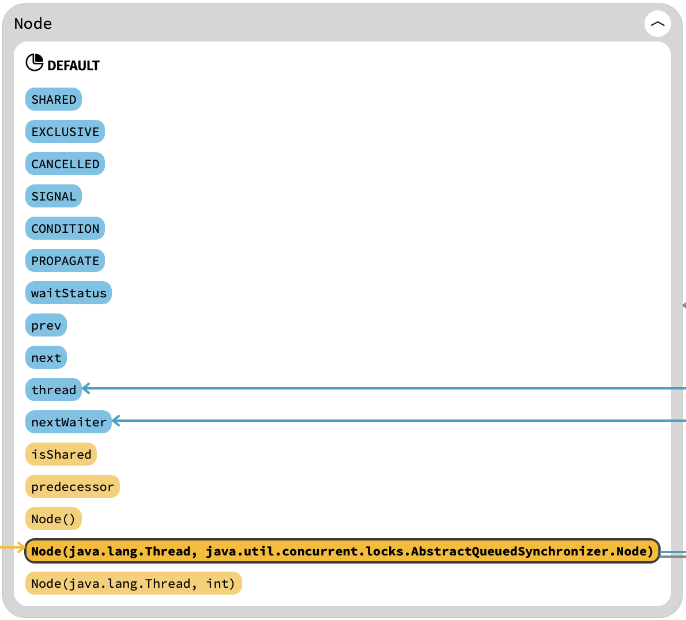
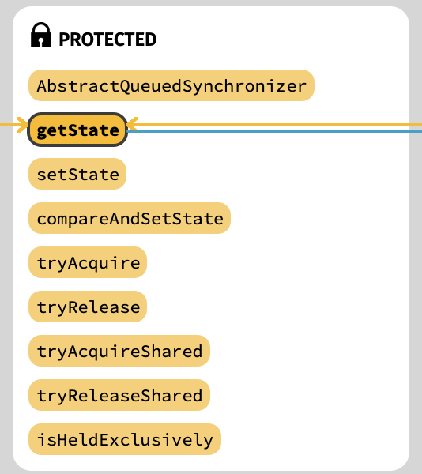

> 看过很多AQS的博客，依然看不懂AQS。所以我计划按照自己的理解整理AQS，对AQS有一个自己的认知。<!--more-->

# method::acquire

```
    public final void acquire(int arg) {
        if (!tryAcquire(arg) &&
            acquireQueued(addWaiter(Node.EXCLUSIVE), arg))
            selfInterrupt();
    }
```


## method::acquireQueued

```java
    final boolean acquireQueued(final Node node, int arg) {
        boolean failed = true;
        try {
            boolean interrupted = false;
            for (;;) {
                final Node p = node.predecessor();
                if (p == head && tryAcquire(arg)) {
                    setHead(node);
                    p.next = null; // help GC
                    failed = false;
                    return interrupted;
                }
                if (shouldParkAfterFailedAcquire(p, node) &&
                    parkAndCheckInterrupt())
                    interrupted = true;
            }
        } finally {
            if (failed)
                cancelAcquire(node);
        }
    }
```


# Node

```java
    static final class Node {
        /** Marker to indicate a node is waiting in shared mode */
        static final Node SHARED = new Node();
        /** Marker to indicate a node is waiting in exclusive mode */
        static final Node EXCLUSIVE = null;

        /** waitStatus value to indicate thread has cancelled */
        static final int CANCELLED =  1;
        /** waitStatus value to indicate successor's thread needs unparking */
        static final int SIGNAL    = -1;
        /** waitStatus value to indicate thread is waiting on condition */
        static final int CONDITION = -2;
        /**
         * waitStatus value to indicate the next acquireShared should
         * unconditionally propagate
         */
        static final int PROPAGATE = -3;

        volatile int waitStatus;

        volatile Node prev;

        volatile Node next;
       
        volatile Thread thread;

        Node nextWaiter;

        /**
         * Returns true if node is waiting in shared mode.
         */
        final boolean isShared() {
            return nextWaiter == SHARED;
        }

        final Node predecessor() throws NullPointerException {
            Node p = prev;
            if (p == null)
                throw new NullPointerException();
            else
                return p;
        }

        Node() {    // Used to establish initial head or SHARED marker
        }

        Node(Thread thread, Node mode) {     // Used by addWaiter
            this.nextWaiter = mode;
            this.thread = thread;
        }

        Node(Thread thread, int waitStatus) { // Used by Condition
            this.waitStatus = waitStatus;
            this.thread = thread;
        }
    }
```





# ConditionObject



