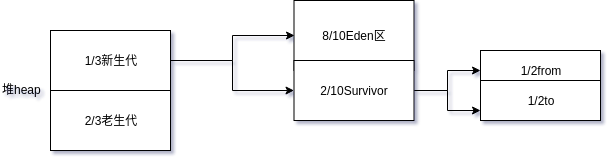
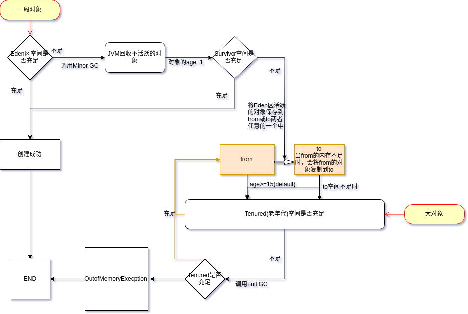
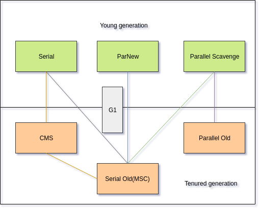

>&emsp;&emsp;在JVM中,进行垃圾回收首先要判断对象对象是否存活，在对不同生命周期的对象进行垃圾回收。在进行垃圾回收时，要根据需求进行垃圾回收算法的选择。（比如注重吞吐量）<!-- more -->  
##### 如何判断对象存活

| 算法 | 思想 | 优缺点 |
| :-: | :-:| :-: |
|引用计数算法| 给对象一个计数器，有人引用就加1,引用失效就减1。当计数器为0时，则对象不再被引用。 | 优点：实现简单，判定效率高。缺点：很难解决对象之间相互循环调用的问题 |
| 可达性分析算法 | 以GC Roots为起点，当一个对象没有以GC Roots为起点的引用链时，则对象不再被引用 |  |  |
在jdk中引用分为强引用、软引用、弱引用、虚引用。  

|强引用|软引用|弱引用|虚引用|
| :-: | :-:| :-: |:-:|
| 强引用只要存在，就不会被回收 | 在系统将要发生内存溢出时，对象将进入二次垃圾回收范围 | 只能生存到下一次垃圾回收之前 |惟一的目的就是能在这个对像被收集器回收时收到一个系统的通知||
##### 对象的创建
>&emsp;&emsp;在JVM中，可以把堆分为1/3的新生代和2/3的老生代。在将新生代按照8:2分为Eden区和Survivor区。而在Survivor区有按照1:1分为两个，记为from，to区。(各参数依据默认参数)  
  
在新创建一个对象时，首先要对一个对象进行判断，是大对象还是一般的对象（需要占用连续的内存空间：如较长的字符串数组）。如果是大对象就会直接进入老年代，否则一般的对象都会进入Eden区。如下图所示：   

而对于垃圾收集器的选择具体如下图所示：

我们需要针对不同的场合选择垃圾收集器。  

| Serial | ParNew | Parallel Scavenge| Serial Old | Parallel Old |
| :-: | :-: | :-: | :-: | :-: | :-: | :-: | :-: |
|单线程的收集器，只会使用一个CPU或一条收集器去完成垃圾收集工作，并在在它进行垃圾收集时，必须暂停其他所有工作的线程|Serial收集器的多线程版本，也同样要暂停其他工作线程。只有它能与CMS收集器配合。|CMS等收集器注重缩短垃圾收集时用户线程的停顿时间，而Parallel Scavenge是达到一个可控制的吞吐量。主要适合在后台运算而不需要太多交互的任务|单线程收集器，使用标记-整理算法。主要用来和JDK1.5及以前的版本中与Parallel Scavenge配合使用和作为CMS收集器的后备预案，在并发收集器发生Concurrent Mode Failure时使用|使用了多线程和标记-整理算法，在注重吞吐量以及CPU资源敏感的场合优先考虑Parallel Scavenge和Parallel Old收集器|
* CMS(Currernt Mark Sweep)
  CMS收集器采用“标记-清除”算法，从而达到以获取最短回收停顿时间的目标。它分为4个步骤：  
  * 初始标记  
  标记GC Roots能直接关联到的对象，速度很快。
  * 并发标记  
  进行GC Roots Tracing的过程。
  * 重新标记  
  为了修正并发标记时间因用户程序继续运作而导致标记产生变动的那一部分对象的标记记录，
  * 并发清除  
  并发清除GC Roots不可达的对象。
  优点：并发收集，低停顿。  
  缺点：1、CMS收集线对CPU资源非常敏感。  
    &emsp;&emsp;&emsp;2、CMS收集器无法处理浮动的垃圾，可能出现“Concurrent Mode Failure”失败而导致另一次Full GC的产生。当出现Concurrent Mode Failure失败时，虚拟机将启动后备预案：临时启用Serial Old收集器来重新进行老年代的垃圾收集，停顿的时间会加长。
    &emsp;&emsp;&emsp;3、“标记-清除”会产生大量的空间碎片。
  
