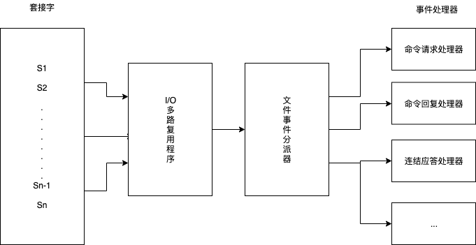

> Redis有两类事件：文件事件和时间事件，这两个事件组成了Redis的服务器的事件驱动程序。<!-- more -->  

###  文件事件

Redis基于Reactor模式开发了自己的网络时间处理器：这个处理器被称为文件事件处理器。

文件事件处理器使用I/O多路复用程序来同时监听多个套接字，并根据套接字目前执行的任务来为套接字关联不同的时间处理器。

当被监听的套接字准备好执行连结应答（accept）读取（read）写入（write）关闭（close）等操作时，与操作相对应的文件事件就会产生，这时文件事件处理器就会调用套接字之前关联好的事件处理器来处理这些事件。

尽管多个文件事件可能会并发地出现，但I/O多路复用程序总是会将所有产生事件的套接字都放到一个队列里面，然后通过这个队列，以有序、同步、每次一个套接字的方式向文件事件分派器传送套接字。

文件事件分派器接受I/O多路复用程序传来的套接字，并根据套接字产生的事件的类型，调用相应的事件处理器。

###  时间事件

Redis的时间事件分为以下两类：

定时事件：让一段程序在指定的时间之后执行一次。
周期事件：让一段程序每隔指定时间就执行一次。

服务器将所有时间事件都放在一个无序链表中，每当时间事件执行器运行时，它就遍历整个链表，查找所有已到达的时间事件，并调用相应的事件处理器。

时间事件的运用实例：serverCron函数，它的主要工作包括：

1. 更新服务器的各类统计信息，比如：时间、内存占用、数据库占用情况等。
2. 清理数据库中的过期键值对。
3. 关闭清理连接失效的客户端。
4. 尝试进行AOF或RDB之久化操作。
5. 如果服务器是主服务器，对从服务器进行定期同步。
6. 如果处于集群模式，对集群进行定期同步和连接测试。

文件事件和时间事件是合作关系，服务器会轮流处理这两种事件，并且处理事件的过程中不会进行抢占。