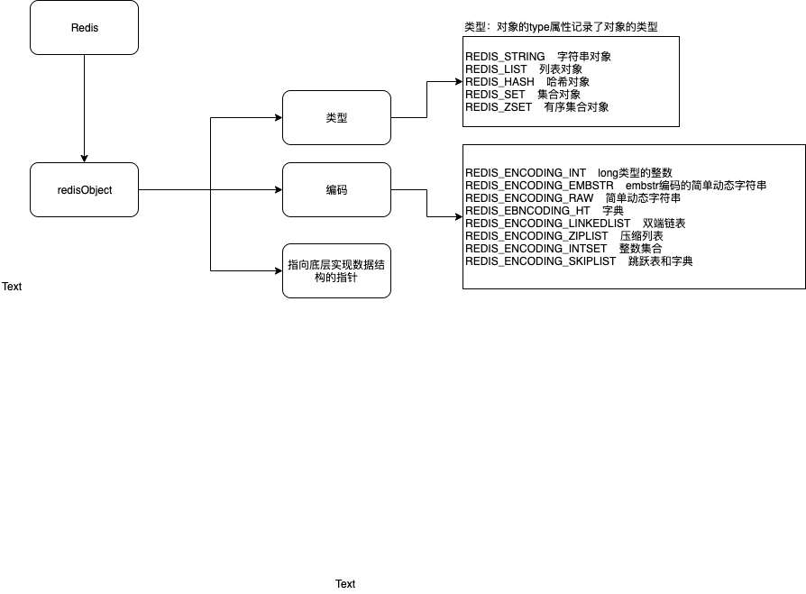

> &emsp;&emsp;首先带着这几个问题：

1. redis有哪些对象？

2. redis对象底层的数据结构是什么？

3. 为什么要选择这种数据结构？ <!-- more -->

   

##### Redis对象

&emsp;&emsp;Redis每创建一个键值对时，至少会创建两个对象，一个对象用作键值对的键，一个用作键值对的值。每一个对象都由一个redisObject结构表示，结构中和保存数据有关的数据有三个属性分别是type属性、encoding属性和ptr属性。

```
typedef struct redisObject {
	// 类型
	unsinged type:4;
	// 编码
	unsinged encoding:4;
	// 指向底层实现数据结构的指针
	void *ptr;
	...
}
```

&emsp;&emsp;Redis的对象有字符串（String），列表（List），集合（Set），哈希（Hash），有序集合（ZSet）这几种对象。

- 字符串对象 

1. 字符串对象的编码可以是int、raw或者embStr。 
2. 对于int编码的字符串对象来说，如果我们执行了一些命令，使得这个对象保存的不再是整数值，而是一个字符串值，那么字符串对象的编码将从int变为raw。 
3. 对embStr编码的字符串对象执行任何修改命令时，程序会先将对象的编码从embStr转换成raw，然后在执行命令。所以，embStr编码的字符串对象在执行修改命令之后，总会变成一个raw编码的字符串对象。 

- 列表对象 

1. 列表对象的编码可以是ziplist或者linkedlist。 

2. ziplist编码的列表对象使用压缩列表作为底层实现，每个压缩列表节点保存一个列表元素。 

3. linkedlist编码的列表对象使用双端链表作为底层实现，每个双端链表节点都保存了一个字符串对象，而每个字符串对象都保存了一个列表元素。 

4. 编码转换 

   &emsp;&emsp;当列表对象可以同时满足以下两个条件时，列表对象使用ziplist编码：列表对象保存的所有字符串元素的长度都小于64字节；列表对象保存的元素数量小于512个；不能满足这两个条件的列表对象需要使用linkedlist编码。 

- 哈希对象 

1. 哈希对象的编码可以是ziplist或者hashtable。 

2. ziplist 编码的哈希对象使用压缩列表作为底层实现，每当有新的键值对要加入到哈希对象时，程序会先将保存了键的压缩列表节点推入到压缩列表表尾，所以保存了同一键值对的两个节点总是紧挨在一起，保存键的节点在前，保存值的节点在后；先添加到哈希对象中的键值对会放在压缩列表的表头方向，而后来添加到哈希对象中的键值对会被放在压缩列表的表尾方向。 

3. hashtable编码的哈希对象使用字典作为底层实现，哈希对象中的每个键值对都使用一个字典值来保存：字典的每个键都是一个字符串对象，对象中保存了键值对的键。字典中的每一个值都是一个字符串对象，对象中保存了键值对的值。 

4. 编码转换 

   &emsp;&emsp;当哈希对象可以同时满足以下两个条件时，列表对象使用ziplist编码：哈希对象保存的所有字符串元素的长度都小于64字节；哈希对象保存的元素数量小于512个；不能满足这两个条件的哈希对象需要使用hashtable编码。 

- 集合对象 

1. 集合对象的编码可以是inset或者hashtable。 

2. inset编码的集合对象使用整数集合作为底层实现，集合对象包含的所有元素都被保存在整数集合里面 

3. hashtable编码的集合对象使用字典作为底层实现，字典的每个键都是一个字符串对象，每个字符串对象包含了一个集合元素，字典的值则全部被设置为null。 

4. 编码的转换 

   &emsp;&emsp;当集合对象可以同时满足以下两个条件时，对象使用insert编码：集合对象保存的所有元素都是整数值,集合对象保存的元素数量小于512个；不能满足这两个条件的哈希对象需要使用hashtable编码。 

- 有序集合对象 

  &emsp;&emsp;有序集合的编码可以是ziplist或者skiplist。 

  1. ziplist编码的有序集合对象使用压缩列表作为底层实现，每个集合元素使用两个紧挨在一起的压缩列表节点来保存，第一个节点保存元素的成员（member），而第二个元素则保存元素的分值（score）。压缩列表内的集合元素按分值从小到大进行排序，分值较小的元素被放置在靠近表头的位置，而分值较大的元素则被放置在靠近表尾的位置。 

  2. skiplist编码的有序集合对象使用zset结构作为底层实现，一个zset结构同时包含一个字典和一个跳跃表。zset结构中的zs1跳跃表按分值从小到大保存了所有集合元素，每个跳跃表节点都保存了一个集合元素：跳跃表节点的object属性保存了元素的成员，而跳跃表节点的score属性则保存了元素的分值。 

  3. 编码转换 

     &emsp;&emsp;当有序集合对象可以同时满足以下两个条件时，对象可以使用ziplist编码：有序集合对象保存的元素数量小于128个；有序集合对象保存的所有元素成员的长度都小于64字节；不能满足这两个条件的列表对象需要使用skiplist编码。 

     
