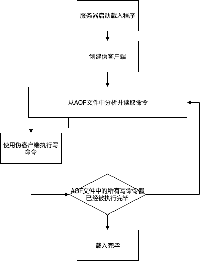
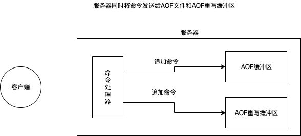

> Redis的持久话方式分为AOF(Append Of File)和RDB两种方式。<!--more--> 

### RDB持久化

#### RDB文件的创建与加载

&emsp;&emsp;有两个Redis命令可用于生成RDB文件，一个SAVE，另一个事BGSAVE。

&emsp;&emsp;SAVE命令会阻塞Redis服务器进程。直到RDB文件创建完成为止，在服务器进程阻塞期间，服务器不能处理任何命令请求。

&emsp;&emsp;BGSAVE命令会派生一个子进程，然后由子进程负责创建RDB文件，服务器进行（父进程）继续处理命令请求。

&emsp;&emsp;RDB文件的载入工作是在服务器启动时自动执行的，所以无论是SAVE、BGSAVE生成的RDB文件，载入的方式都是一致的。只要RDB服务器在启动时检测到RDB文件存在，它就会自动载入RDB文件。

&emsp;&emsp;因为AOF文件的更新频率通常比RDB文件的更新的频率高，所以:

1. 如果服务器开启了AOF持久化功能，那么服务器会优先使用AOF文件来还原数据库状态。
2. 只有在AOF持久化功能处于关闭状态时，服务器才使用RDB文件来还原数据库状态。

&emsp;&emsp;服务器禁止SAVE命令和BGSAVE命令同时执行是为了父进程（服务器进程）和子进程同时执行两个rdbSave调用，防止发生竞争。其次，在BGSAVE命令执行期间，客户端发送的BGSAVE命令会被服务器拒绝，因为同时执行两个BGSAVE也会产生竞争条件。

&emsp;&emsp;因为BGSAVE命令可以不阻塞服务器进程的情况下执行，所以Redis允许用户通过设置服务器配置的save选项，让服务器每个一段时间自动执行一次BGSAVE命令。

### AOF持久化

AOF持久化的功能可以分为命令追加（append）、文件写入、文件同步（sync）三个步骤。

#### AOF文件的创建

##### 命令追加

&emsp;&emsp;当AOF持久化功能处于打开状态时，服务器在执行完一个写入命令之后，会以协议格式将被执行的写命令追加到服务器状态的aof buf缓冲区的末尾。

##### AOF的文件写入

&emsp;&emsp;Redis的服务器进程就是一个事件循环。因为服务器在处理文件事件时可能会执行写命令，使得一些内容被追加到aof_buf缓冲区里面，所以在服务器每次结束一个事件循环之前，它都会调用flushAppendOnlyFile函数，考虑是否需要将aof_buf缓冲区中的内容写入和保存到aof文件里面。

##### AOF的文件同步

&emsp;&emsp;为了提高文件的写入效率，在现代操作系统中，当用户调用writer函数，将一些数据写入到文件的时候，操作系统通常会将写入数据暂时保存在一个内存缓冲区里面，等到缓冲区的空间被填满，或者超过了指定的时限之后，才真正地将缓冲区中的数据写入到磁盘里面。

&emsp;&emsp;为此，系统提供了fsync和fdatasync两个同步函数，它们可以强制让操作系统立即将缓冲区中的数据写入到硬盘里面，从而确保写入数据的安全性。

#### AOF文件载入与数据还原

#### AOF重写 

&emsp;&emsp;为了解决AOF文件体积膨胀的问题，Redis提供了AOF文件重写（rewrite）功能。通过该功能，Redis服务器可以创建一个新的AOF文件来替代现有的AOF文件，新旧两个AOF文件所保存的数据库状态相同，但新AOF文件不包含任何浪费空间的冗余命令，所以新AOF文件的体积通常会比AOF文件的体积要小的多。

&emsp;&emsp;虽然Redis将生成新AOF文件替换旧AOF文件的功能命名为“AOF文件重写”，但实际上，AOF重写并不需要对现有的AOF文件进行任何读取、分析、或着写入操作，这个功能是通过读取服务器当前的数据库状态来实现的。

&emsp;&emsp;首先从数据库中读取键现在的值，然后用一条命令去记录键值对，代替之前记录这个键值对的多条命令，这就是AOF重写功能的实现。（先读后写）

&emsp;&emsp;Redis不希望AOF重写造成服务器无法处理请求，所以Redis决定将AOF重写程序放到子进程里执行，可以同时达到两个目的：

1. 子进程进行AOF重写期间，服务器进行（父进程）可以处理命令请求。
2. 子进程带有服务器进程的数据副本，使用子进程而不是线程，可以在避免使用锁的情况下，保证数据的安全性。

##### AOF重写过程中数据不一致的问题解决

&emsp;&emsp;为了解决这种数据不一致问题，Redis服务器设置了一个AOF重写缓冲区，这个缓冲区在服务器创建子进程之后开始使用，当Redis服务器执行了一个写命令之后，它会同时将这个写命令发送给AOF缓冲区和AOF重写缓冲区。

当子进程完成AOF重写工作之后，它会向父进程发送一个信号，父进程在接到该信号之后，会调用一个信号处理函数，并执行以下工作：

1. 将AOF重写缓冲区中的所有内容写入到新AOF文件汇总，这是新AOF文件所保存的数据库将和服务器当前的数据库状态一致。
2. 对新的AOF文件进行改名，原子地覆盖现有的AOF文件，完成新旧两个AOF文件的替换。

&emsp;&emsp;在整个AOF后台重写过程中，只有信号处理函数执行时会对服务器进程（父进程）造成阻塞，其余时间，AOF后台重写都不会阻塞父进程。

