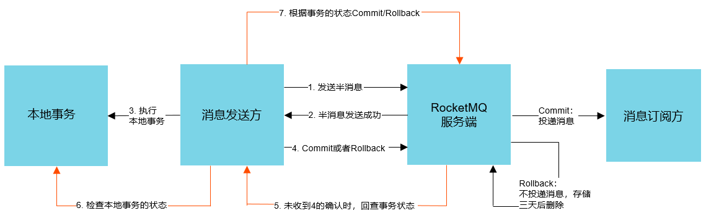

> RocketMQ的事务消息用途广泛，也是很多人消息中间件选择RocketMQ的一个重要原因。<!--more-->

#### 事务消息

RocketMQ的事务消息队列提供类似X/Open XA的分布式事务功能，通过消息队列RocketMQ事务消息能达到分布式事务的最终一致。

半消息：暂不能投敌的消息，发送方已经将消息成功地发送到了消息队列RocketMQ服务段，但是服务端未收到生产着对该消息的二次确认，此时该消息被标记成“暂不能投递”状态，处于该种状态下的消息即为半消息，

消息回查：由于网络闪断、生产者应用重启等原因，导致某条事务消息的二次确认丢失，消息队列RocketMQ服务端通过扫描发现某条消息长期处于“半消息”时，需要主动向消息生产者询问该消息的最终状态（Commit或是Rollback），此过程即为消息回查。

1. 发送方向消息队列RocketMQ服务端发送消息。
2. 服务端将消息持久化成功后，向发送方ACK确认消息已经发送成功，此时消息为半消息。

3. 发送方开始执行本地事务逻辑。
4. 发送方根据本地事务执行结果向服务端提交二次确认（commit或是rollback），服务端收到commit状态

则将半消息标记为可投递状态，订阅方最终将收到该消息；服务端收到rollback状态，则删除半消息，订阅方将不会收到该消息。

5. 在断网或者是应用重启的特殊情况下，上述步骤4提交的二次确认没有抵达RocketMQ的服务端，经过固定时间后，服务端将会对消息进行回查。
6. 发送方收到消息回查结果后，需要检查对应消息的本地事务执行的最终结果。

7. 发送方根据检查到的本地事务的最终状态再此提交二次确认，服务端仍按照步骤四对半消息进行操作。

在实际操作中需要注意的是事务消息的Group ID不能与其他类型消息的Group ID共用。与其他消息不同的是，事务消息有回查机制，回查时消息队列RocketMQ服务端会根据Group ID去查询客户端。如果是通过 ONSFactory.createTransactionProducer 创建事务消息的 Producer 时必须指定 LocalTransactionChecker 的实现类，处理异常情况下事务消息的回查。