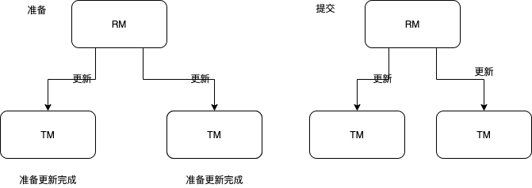
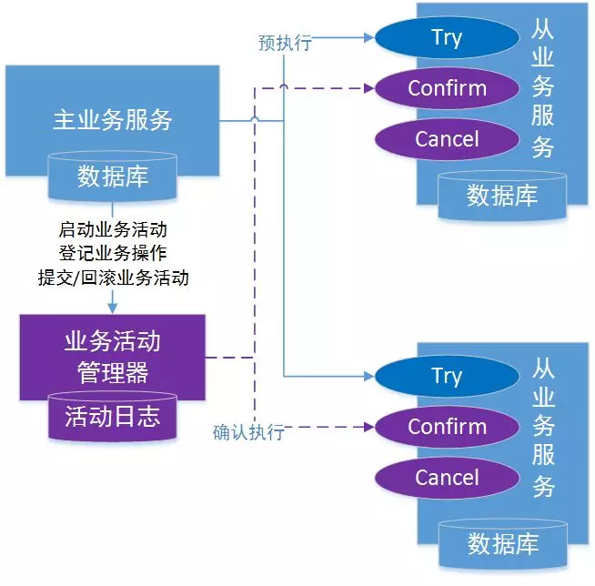

>  事务在分布式服务中至关重要，本文主要学习TCC三阶段的流程与模式。了解XA模式。<!--more-->

### 事务特性

数据库事务是指数据库执行过程中的一个逻辑单位，由一个有限的数据库操作序列构成。

事务有ACID四个特性：

1. 原子性：事务作为一个整体被执行，包括在其中的对数据的操作要么全部执行要么全部被执行，要么都不执行。
2. 一致性：事务应确保数据库的状态从一个一致状态转变为另一个一致状态。一致状态是指数据库中的数据应该满足完整性约束。
3. 隔离性：多个事务并发执行时，一个事务的执行不应影响其他事务的执行，如同只有这一个操作在被数据库所执行一样。
4. 持久性：已被提交的事务对数据库的修改应该永久保存在数据库中。在事务结束时，此操作不可逆转。

### 分布式事务

#### XA协议

XA协议由Tuxedo首先提出，并交给X/Open组织，作为资源管理器（数据库）与事务管理器的接口标准。XA协议采用两阶段提交的方式来管理分布式事务。XA接口提供资源管理器与事务管理器之间进行通信的标准交口。

资源管理器（RM）：资源管理器提供对事务性资源的访问。数据库其实就是一种资源管理器，必须提交或者回滚由RM管理的事务。

事务管理器（TM）：主要协调作为全局事务中的部分事务。它作为RMS中每个事务的协调者。

执行全局事务的过程采用两阶段提交（2PC），全局事务是发生在分支执行的操作之后的：

第一阶段：所有分支的操作都准备好了，由TM告知每个分支准备提交，此时，作为全局事务中的每个RM记录着在稳定存储中的动作。

第二阶段：TM会告诉RMS是否提交或回滚，如果所有分支表明准备好能够提交时，RMS会被告知提交，如果任何一个RM表明没有准备好或者不能提交，则进行全部回滚。

#### TCC提交

TCC(Try-Confirm-Cancel)分布式事务模型相对于XA等传统模型，其特征在于它不依赖资源管理器（RM）对分布式事务的支持，而是通过对业务逻辑的分解来实现分布式事务。

初步操作Try：完成所有业务检查，预留必须的业务资源。

确认操作Confirm：真正执行的业务逻辑，不在任务业务检查，只使用Try阶段预留的业务资源。因此，只要Try操作成功，Confirm必须能成功。另外，Confirm操作需满足幂等性，保证一笔分布式事务又且只能成功一次。

取消操作Cancel：释放Try阶段预留的业务资源。同样的，Cancel操作也需要满足幂等性。

TCC分布式事务模型包括三部分：

1. 主业务服务：主业务服务为整个业务活动的发起方，服务的编排者，负责发起并完成整个业务活动。
2. 从业务服务：从业务服务是整个业务活动的参与方，负责提供TCC业务操作，实现初步操作（Try），确认操作（Confirm）、取消操作（Cancel）三个借口，供主业务服务调用。
3. 业务活动管理器：业务活动管理器管理控制整个业务活动，包括记录维护TCC全局事务的事务状态和每个从业务服务的子事务状态，并在业务活动提交时调用所有从业务服务的Confirm操作，在业务活动取消调用所有从业务服务的Cancel操作。

TCC分布式事务流程：

1. 主业务服务首先开启本地事务。
2. 主业务服务向业务活动管理器申请启动分布式事务业务活动。
3. 然后针对要调用的从业务服务，主业务活动先向业务活动管理器注册业务活动，然后调用从业务服务的Try接口；
4. 当所有从业务服务的Try接口调用成功，主业务服务提交本地事务；若调用失败，主业务服务回滚本地事务。
5. 若主业务服务提交本地事务，则TCC模型分别调用所有从业务服务的Confirm接口；若主业务服务回滚本地事务，则分别调用Cancel接口；
6. 所有从业务服务的Confirm或Cancel操作完成后，全局事务结束。

### 例子

写了一个例子用来学习TCC，地址：https://github.com/yosamaru/tccDemo